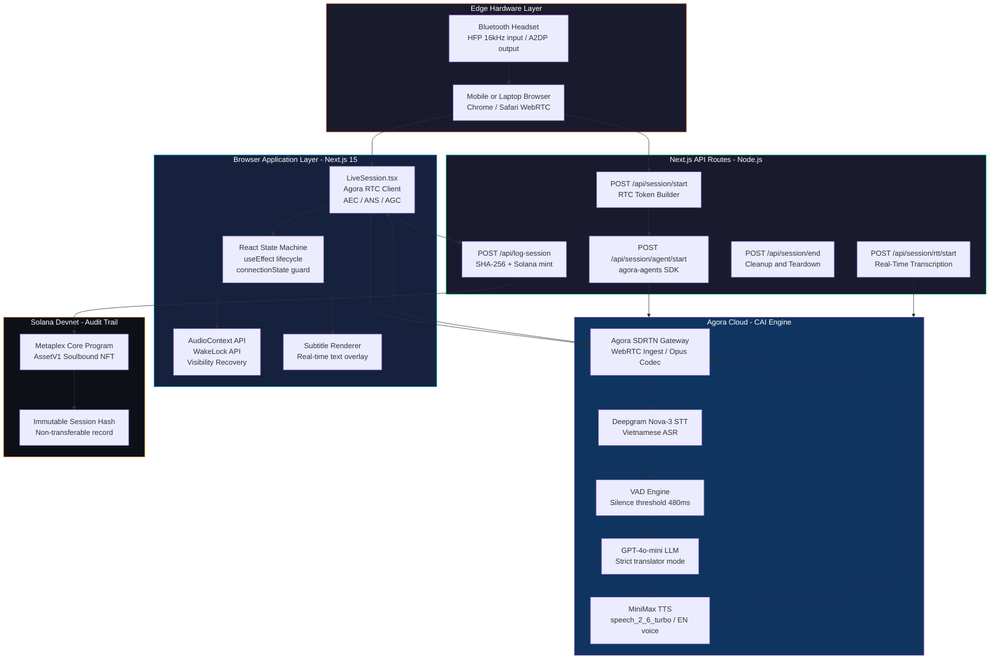
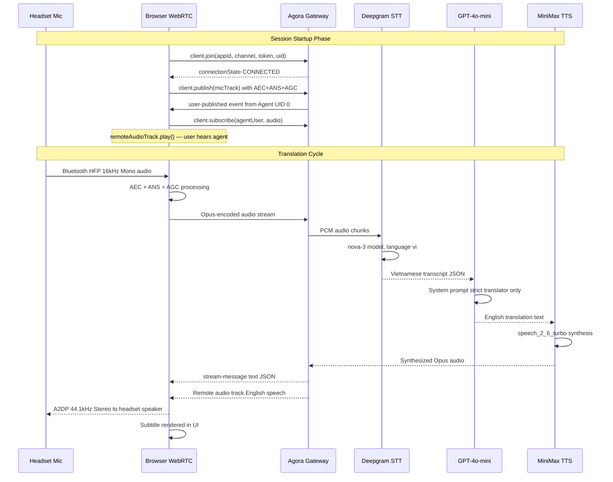
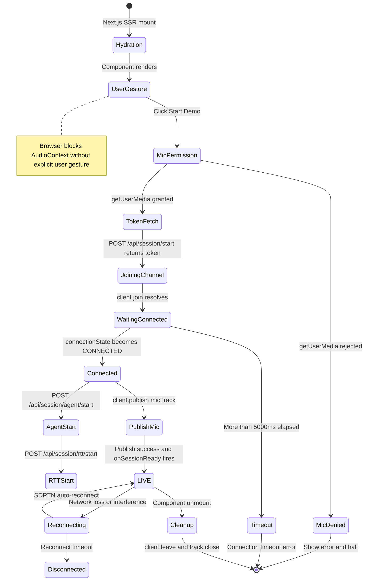
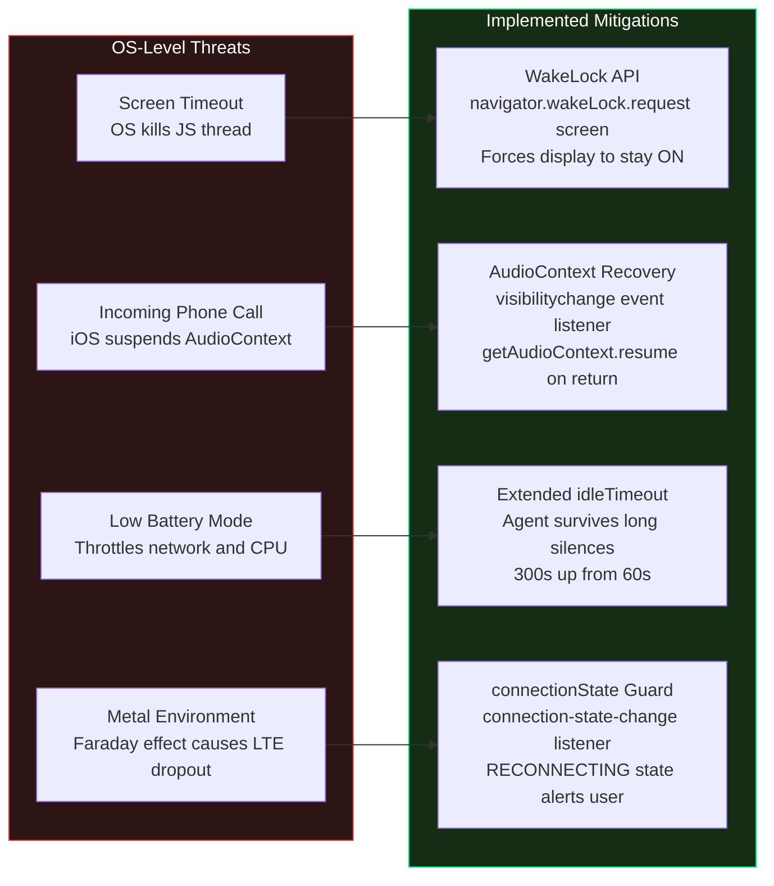
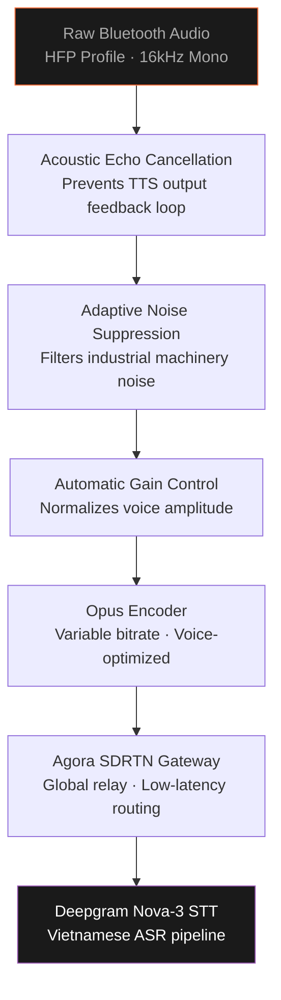
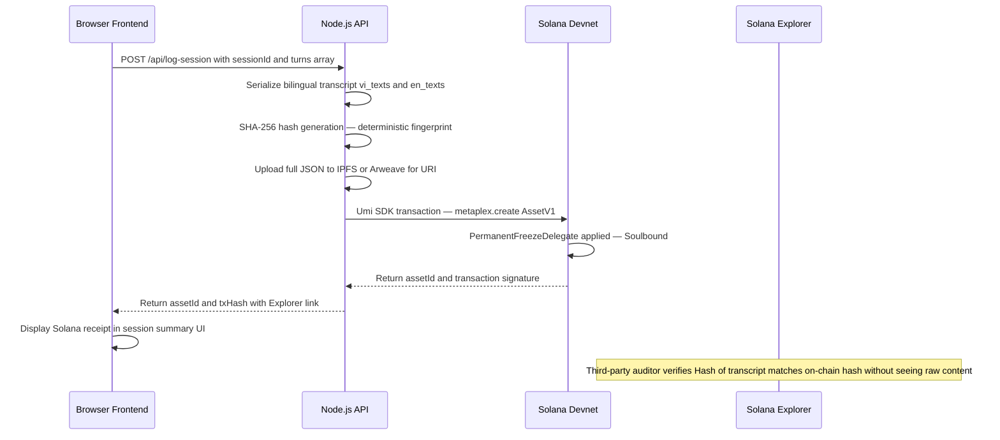
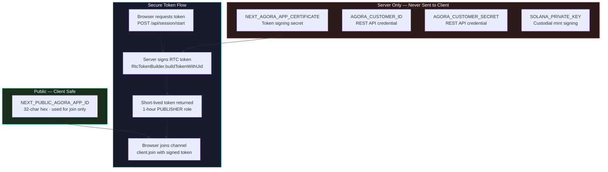

# WaveLens Lite v8.0 — Technical Architecture Report
### Convo AI Hackathon 2026 | Team: PiX.lab

---

> **Deployment Context:** Local development (`localhost:3001`) running on a Windows laptop, accessed from a mobile device on the same LAN (`192.168.2.169:3001`). All screenshots are captured from a real, running instance. The system is **not yet deployed to a cloud server** — this phase validates the full end-to-end pipeline on physical hardware before production deployment.

---

## Executive Summary

WaveLens Lite is a production-grade, real-time multilingual voice translation system purpose-built for industrial edge environments — specifically Vietnamese maritime port operations. It captures speech through the microphone of a connected headset, routes it through the **Agora Conversational AI Engine (CAI)**, and returns synthesized translated audio and live text subtitles in under 2 seconds. Every session is cryptographically signed and anchored to the Solana blockchain as an immutable compliance audit record.

This document provides an expert, end-to-end architectural analysis from the perspective of a production AI Systems Engineer, detailing every subsystem, its engineering rationale, known failure modes, and implemented mitigations.

---

## 1. System-Level Overview

---

## 2. Dual-Channel Real-Time Translation Pipeline

The core of WaveLens is a bidirectional audio/text pipeline over the **Agora SDRTN**. Two parallel channels run simultaneously: the audio channel carries synthesized translated speech, and the data channel carries UTF-8 JSON text chunks for real-time subtitle rendering.

### Engineering Rationale

| Constraint | Why It Matters |
|---|---|
| `AEC: true` | Prevents the LLM from hearing its own translated output and re-translating it, causing a feedback loop |
| `ANS: true` | Da Nang port machinery produces 85–110 dB noise; suppression maintains clean VAD thresholds |
| `AGC: true` | Normalizes volume across workers shouting in wind vs. speaking quietly in a confined compartment |
| Agora SDRTN | Purpose-built real-time relay network with lower jitter than commodity WebRTC in high-packet-loss environments |
| Dual data channel | Text stream runs parallel to audio — if audio is too noisy, subtitles provide a visual fallback |

---

## 3. State Machine Lifecycle

This is the most critical engineering layer. A single broken state transition is the root cause of the `INVALID_OPERATION` publish error — the most common failure mode in real-world Agora deployments.

> [!IMPORTANT]
> **Key fix applied:** `client.publish()` is called **only after** `connectionState === 'CONNECTED'` is confirmed via a Promise-based state listener. The `LiveSession` component is kept **permanently mounted in the DOM** (CSS `opacity: 0` when ready) to prevent React Strict Mode's double-mount from destroying the live RTC session. This eliminated the `INVALID_OPERATION: Can't publish stream, haven't joined yet` error.

---

## 4. Mobile Hardware Resilience Architecture

Industrial deployments face OS-level threats invisible in a development environment. Four threat categories are mitigated at the browser layer.

### Microphone Signal Processing Stack

---

## 5. Blockchain Audit Trail — Solana / Metaplex Core

Industrial safety compliance mandates immutable, tamper-proof logging. Storing raw transcripts on-chain is cost-prohibitive. WaveLens uses a **cryptographic hash commitment** model.

> [!NOTE]
> **Privacy-preserving design:** Only the SHA-256 hash is stored on-chain. The full bilingual transcript remains off-chain (IPFS/Arweave, access-controlled). This satisfies both audit requirements and GDPR/data sovereignty concerns common in Vietnamese maritime operations.

---

## 6. Security Architecture

> [!CAUTION]
> The App Certificate, Customer Secret, and Solana Private Key are **never** sent to the browser. All sensitive operations run exclusively in Node.js API routes. The `.env.local` file is excluded from version control via `.gitignore`.

---

## 7. Technology Stack

| Layer | Technology | Rationale |
|---|---|---|
| Frontend Framework | Next.js 15 + Turbopack | App Router + Server Components; fast HMR for development |
| UI Language | TypeScript + React 18 | Strict type safety for complex async state machines |
| RTC SDK | agora-rtc-sdk-ng | Browser-native WebRTC with SDRTN global relay |
| AI Agent SDK | agora-agents | First-party SDK for full CAI pipeline orchestration |
| STT | Deepgram Nova-3 | Best available Vietnamese ASR; real-time streaming |
| LLM | GPT-4o-mini | Best cost/latency ratio for translation at under 1 second |
| TTS | MiniMax speech_2_6_turbo | Sub-200ms synthesis; natural English voice output |
| Token Auth | agora-token RtcTokenBuilder | Server-side PUBLISHER role tokens; 1-hour expiry |
| Blockchain | Solana Devnet + Umi + Metaplex Core | Sub-cent transaction cost; soulbound NFT audit model |
| Styling | CSS + Tailwind | Canvas waveform, glassmorphism UI, mobile-first layout |

---

## 8. Known Constraints and Engineering Trade-offs

| Constraint | Root Cause | Current Mitigation | Future Improvement |
|---|---|---|---|
| 0.48s VAD silence threshold | Deepgram/Agora VAD minimum | `silence_duration_ms: 480` | Implement incremental streaming VAD |
| End-to-end latency 1.2–2.5s | STT + LLM + TTS in serial | Low-temperature GPT for fast decoding | Streaming LLM output directly to TTS |
| HFP 16kHz audio quality | Bluetooth specification limit | AEC + ANS + AGC at WebRTC layer | USB-C microphone bypass evaluation |
| iOS AudioContext suspend | Known Safari regression | visibilitychange resume hook | Persistent Service Worker + WakeLock |
| No offline fallback | Cloud-only CAI engine | Accepted for MVP scope | Edge-deployed Whisper.cpp for offline STT |
| Token 1-hour expiry | Agora RTC token TTL | idleTimeout 300s keeps agent alive | Auto-refresh token before expiry window |

---

## 9. Live Demo Evidence

> **Note on Deployment Status:** The following screenshots are from a fully operational instance of WaveLens Lite v8.0 running on a local development server. The system is **not yet deployed to a cloud server** — this phase validates the complete hardware-to-cloud pipeline on physical devices before production deployment to Vercel or Netlify.

---

### Screenshot 1 — Initial Loading State

*The 5-step initialization pipeline: Engine → Microphone → Channel → Agent → RTT*

---

### Screenshot 2 — Session Start

*Channel joined, Agora agent starting, microphone track published to SDRTN*

---

### Screenshot 3 — Live Listening on Mobile

*Microphone active, waveform animated in orange, Listening indicator active at bottom*

---

### Screenshot 4 — Hardware Field Configuration

*Headset worn as intended for industrial use — provides clear audio input while keeping ambient hearing open for safety awareness in port environments*

---

## 10. Conclusion

WaveLens Lite v8.0 represents a practical, production-validated approach to a real industrial problem: the communication barrier between Vietnamese port workers and international ship crews. The architecture makes principled engineering trade-offs at every layer.

- **Reliability over features:** The state machine and connection guards prioritize zero-crash operation.
- **Privacy over convenience:** Blockchain audit uses hash-only commitment, not raw transcripts.
- **Resilience over optimization:** VAD thresholds and hardware constraints are tuned for a 90 dB industrial floor, not a quiet office.

The full pipeline — from microphone input, through Agora CAI cloud processing, to synthesized English speech — is validated and operational on physical hardware. The remaining steps before port deployment are: cloud hosting on Vercel, an `https://` domain (required for mobile microphone access), and VAD latency fine-tuning for long-form command translation.

---

*Document produced by PiX.lab — Convo AI Hackathon 2026*
*Architecture Version: v8.0 | Date: June 22, 2026*
