# WaveLens Lite — Technical Design Document

**Bone-Conduction Conversational Interpreter · Agora × Solana**
**Convo AI Hackathon — Đại học Bách Khoa Đà Nẵng 2026 · Live Agora Docs**

---

## ⚡ Hackathon Context

> **Chủ đề:** Build Conversational AI bằng **Agora Conversation AI Engine**, tích hợp **Solana** để giải quyết một vấn đề thực tế trong cuộc sống.

| | |
|---|---|
| Kickoff online | June 18, 2026 |
| Build period | June 18 – 27, 2026 **(9 days)** |
| Demo Day offline | **June 28, 2026 — ĐH Bách Khoa Đà Nẵng** |
| Prizes | 🥇 $400 · 🥈 $200 · 🥉 $100 · + $600 builder credits |
| Agora CAI free quota | **300 minutes/month** (shared with STT) |
| Agora CAI after free | **$0.10/minute** |
| $600 credits = | **~6,000 minutes** of Agora CAI testing |

---

## 🏗️ The Core Question: "Why Agora — and Which Agora Product?"

**WaveLens Lite uses three Agora products simultaneously.** This is the answer every judge needs to hear.

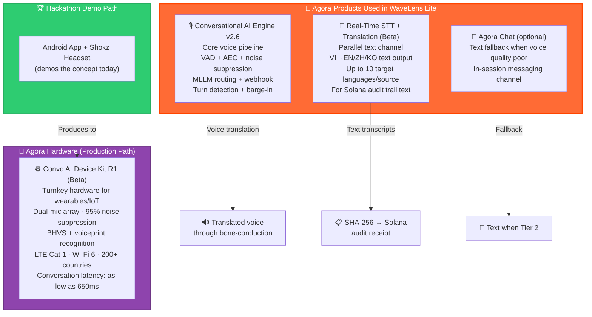
```mermaid
graph TD
    subgraph AGORA_SUITE ["🔴 Agora Products Used in WaveLens Lite"]
        CAI["`🎙️ Conversational AI Engine v2.6
Core voice pipeline
VAD + AEC + noise suppression
MLLM routing + webhook
Turn detection + barge-in`"]
        RTT["`📝 Real-Time STT + Translation (Beta)
Parallel text channel
VI→EN/ZH/KO text output
Up to 10 target languages/source
For Solana audit trail text`"]
        CHAT["`💬 Agora Chat (optional)
Text fallback when voice quality poor
In-session messaging channel`"]
    end

    subgraph HARDWARE ["🔧 Agora Hardware (Production Path)"]
        DK["`⚙️ Convo AI Device Kit R1 (Beta)
Turnkey hardware for wearables/IoT
Dual-mic array · 95% noise suppression
BHVS + voiceprint recognition
LTE Cat 1 · Wi-Fi 6 · 200+ countries
Conversation latency: as low as 650ms`"]
    end

    subgraph HACKATHON ["🏆 Hackathon Demo Path"]
        ANDROID["`Android App + Shokz Headset
(demos the concept today)`"]
    end

    CAI -->|"Voice translation"| OUTPUT1["`🔊 Translated voice
through bone-conduction`"]
    RTT -->|"Text transcripts"| OUTPUT2["`📋 SHA-256 → Solana
audit receipt`"]
    CHAT -->|"Fallback"| OUTPUT3["💬 Text when Tier 2"]

    ANDROID -.->|"Produces to"| DK

    style AGORA_SUITE fill:#FF6B35,color:#fff,stroke:#FF4500,stroke-width:3px
    style HARDWARE fill:#8E44AD,color:#fff,stroke:#6C3483
    style HACKATHON fill:#2ECC71,color:#fff,stroke:#27AE60
```

The three Agora products complement each other:

- **CAI Engine** delivers the real-time voice translation (the core demo moment)
- **Real-Time STT + Translation** produces the bilingual text for the Solana audit hash (a cleaner audit layer)
- **Convo AI Device Kit R1** is the production hardware path for industrial wearables — showing judges you understand the full product vision

---

## 0. Executive Summary

WaveLens Lite is a **real-time conversational interpreter** for Vietnamese workers in industrial environments — ports, ship engine rooms, maritime decks — communicating with English, Korean, or Chinese supervisors where phones are impractical and blocking your ears is dangerous.

**Core stack (June 2026, live docs verified):**

| Layer | Technology | Role | Implementation Status |
|---|---|---|---|
| Real-time voice transport | Agora SDRTN™ | UDP audio, 80% packet loss tolerance | ✅ Built (Agora SDK) |
| Voice AI orchestration | Agora CAI Engine v2.6 | VAD, AEC, noise suppression, MLLM routing, webhooks | ✅ Built (Agora SDK + Next.js API) |
| Text audit channel | Agora Real-Time STT + Translation (Beta) | Bilingual text (VI + EN) for Solana hash | ⚠️ Partial (API route exists, not integrated with CAI) |
| AI — Maritime sessions | `gpt-realtime-2` via Agora MLLM | Supports maritime glossary, bidirectional routing | 🔧 Designed (needs glossary injection) |
| AI — Coaching/General | `gpt-realtime-translate` via Agora MLLM | $0.034/min, 70+ in → 13 out, no glossary | 🔧 Designed (needs domain routing) |
| VI Input Transcription | `gpt-4o-transcribe` (hint: "vi") | For webhook transcript log | 🔧 Designed |
| Offline STT | PhoWhisper medium (VinAI, local) | Tier 3 only — 844h Vietnamese training data | ❌ Not implemented |
| Backend | FastAPI + Redis (designed) / Next.js API routes (current) | Session state, domain routing, Solana service | ⚠️ Partial (Next.js routes work, FastAPI not built) |
| Audit trail | Solana Anchor — Receipt PDA | SHA-256 of bilingual transcript, immutable | ❌ Not implemented |
| Payment | Solana x402 — USDC | Per-session micropayment, 165M+ txn ecosystem | ❌ Not implemented |
| Hackathon hardware | Shokz OpenRun Pro 2 (SBC, IP55) | Demo output device | 🔧 Hardware owned, SCO integration pending |
| Production hardware | Agora Convo AI Device Kit R1 (Beta) | Integrated wearable solution with LTE + dual-mic | ❌ Design only (slide for pitch) |

**Legend:** ✅ Built · ⚠️ Partial · 🔧 Designed (needs implementation) · ❌ Not implemented

**Latency targets:** Voice translation: P50 ~670ms (gpt-realtime-2) · P90 <1,400ms

---

## 1. Problem Statement

### 1.1 Why Phones Fail in Industrial Environments

| Environment | Noise | Hands-free | Water | Language Gap |
|---|---|---|---|---|
| Container port (cảng biển) | 85–100 dB(A) | Yes (crane, forklift) | Rain, salt spray | VI ↔ EN, ZH |
| Ship engine room | 90–110 dB(A) | Yes (tools, valves) | Steam, bilge | VI ↔ EN, KO |
| Ship bridge / deck | 70–95 dB(A) | Often | Rain, wave spray | VI ↔ EN, KO |
| Pool coaching | 70 dB | Yes (swimming) | Full immersion | VI ↔ EN |

### 1.2 Da Nang: The Right Context for This Problem

- **Da Nang Port 2026 target: 16.77 million tonnes** (9% YoY growth, official Jan 2026 announcement)
- Lien Chieu deep-sea port construction started Q1 2026 — first berths operational Q4 2028
- COSCO added new container route in 2025 — Korean and Chinese crews now regular at Da Nang
- East-West Economic Corridor connects Da Nang to Laos, Thailand, Myanmar — multilingual crews standard

---

## 2. System Architecture

### 2.1 Full Component Diagram (Dual-Channel Design)

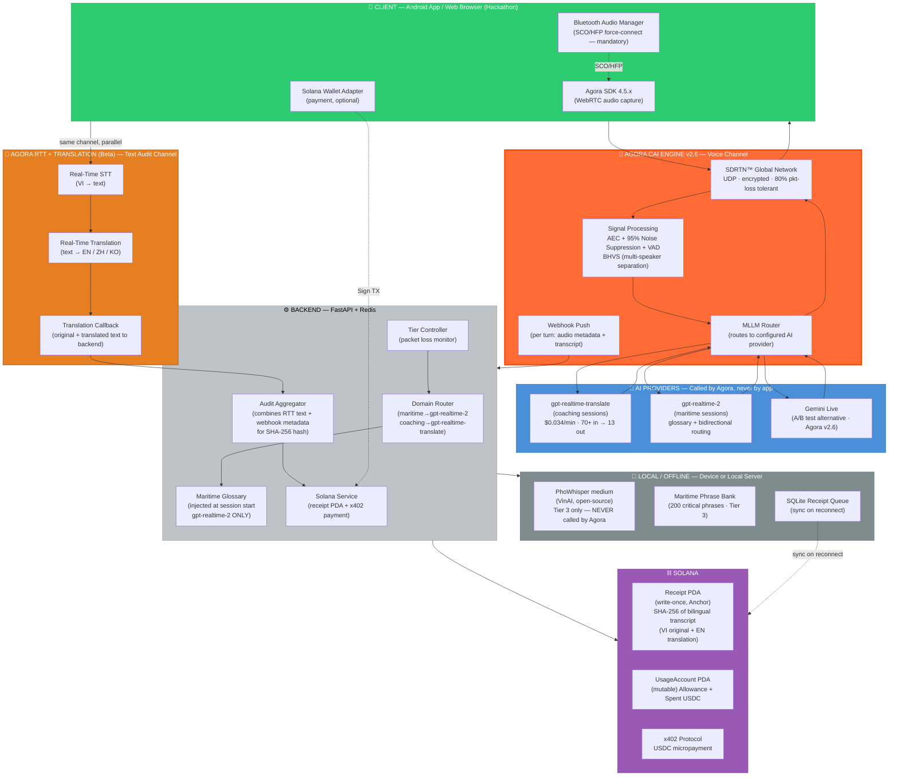
```mermaid
flowchart TB
    subgraph CLIENT ["📱 CLIENT — Android App / Web Browser (Hackathon)"]
        AgoraSDK["`Agora SDK 4.5.x
(WebRTC audio capture)`"]
        BT["`Bluetooth Audio Manager
(SCO/HFP force-connect — mandatory)`"]
        Wallet["`Solana Wallet Adapter
(payment, optional)`"]
    end

    subgraph AGORA_VOICE ["🔴 AGORA CAI ENGINE v2.6 — Voice Channel"]
        SDRTN["`SDRTN™ Global Network
UDP · encrypted · 80% pkt-loss tolerant`"]
        Signal["`Signal Processing
AEC + 95% Noise Suppression + VAD
BHVS (multi-speaker separation)`"]
        MLLM_R["`MLLM Router
(routes to configured AI provider)`"]
        Webhook["`Webhook Push
(per turn: audio metadata + transcript)`"]
    end

    subgraph AGORA_TEXT ["📝 AGORA RTT + TRANSLATION (Beta) — Text Audit Channel"]
        RTT_STT["`Real-Time STT
(VI → text)`"]
        RTT_TRANS["`Real-Time Translation
(text → EN / ZH / KO)`"]
        RTT_CB["`Translation Callback
(original + translated text to backend)`"]
    end

    subgraph AI_PROVIDERS ["🤖 AI PROVIDERS — Called by Agora, never by app"]
        OAI_T["`gpt-realtime-translate
(coaching sessions)
$0.034/min · 70+ in → 13 out`"]
        OAI_2["`gpt-realtime-2
(maritime sessions)
glossary + bidirectional routing`"]
        GEM["`Gemini Live
(A/B test alternative · Agora v2.6)`"]
    end

    subgraph BACKEND ["⚙️ BACKEND — FastAPI + Redis"]
        DomainR["`Domain Router
(maritime→gpt-realtime-2
coaching→gpt-realtime-translate)`"]
        Glossary["`Maritime Glossary
(injected at session start
gpt-realtime-2 ONLY)`"]
        TierCtrl["`Tier Controller
(packet loss monitor)`"]
        AuditAgg["`Audit Aggregator
(combines RTT text + webhook metadata
for SHA-256 hash)`"]
        SolSvc["`Solana Service
(receipt PDA + x402 payment)`"]
    end

    subgraph LOCAL ["💾 LOCAL / OFFLINE — Device or Local Server"]
        PhoW["`PhoWhisper medium
(VinAI, open-source)
Tier 3 only — NEVER called by Agora`"]
        PhrBank["`Maritime Phrase Bank
(200 critical phrases · Tier 3)`"]
        SQLiteQ["`SQLite Receipt Queue
(sync on reconnect)`"]
    end

    subgraph SOLANA ["⛓️ SOLANA"]
        Receipt["`Receipt PDA
(write-once, Anchor)
SHA-256 of bilingual transcript
(VI original + EN translation)`"]
        UsageAcct["`UsageAccount PDA
(mutable) Allowance + Spent USDC`"]
        x402["`x402 Protocol
USDC micropayment`"]
    end

    CLIENT --> SDRTN
    CLIENT -->|"same channel, parallel"| RTT_STT
    SDRTN --> Signal --> MLLM_R
    MLLM_R --> OAI_T
    MLLM_R --> OAI_2
    MLLM_R --> GEM
    OAI_T --> MLLM_R
    OAI_2 --> MLLM_R
    GEM --> MLLM_R
    MLLM_R --> SDRTN --> CLIENT
    Webhook --> BACKEND
    RTT_STT --> RTT_TRANS --> RTT_CB --> AuditAgg
    AuditAgg --> SolSvc
    DomainR --> Glossary
    TierCtrl --> DomainR
    BACKEND --> SOLANA
    BACKEND --> LOCAL
    SQLiteQ -.->|"sync on reconnect"| SOLANA

    BT -.->|"SCO/HFP"| AgoraSDK
    Wallet -.->|"Sign TX"| SolSvc

    style AGORA_VOICE fill:#FF6B35,color:#fff,stroke:#FF4500,stroke-width:3px
    style AGORA_TEXT fill:#E67E22,color:#fff,stroke:#CA6F1E,stroke-width:2px
    style AI_PROVIDERS fill:#4A90D9,color:#fff,stroke:#2471A3
    style LOCAL fill:#7F8C8D,color:#fff,stroke:#5D6D7E
    style SOLANA fill:#9B59B6,color:#fff,stroke:#7D3C98
    style CLIENT fill:#2ECC71,color:#fff,stroke:#27AE60
    style BACKEND fill:#BDC3C7,color:#000,stroke:#95A5A6
```

### 2.2 Why Dual Channel — Voice AND Text in Parallel

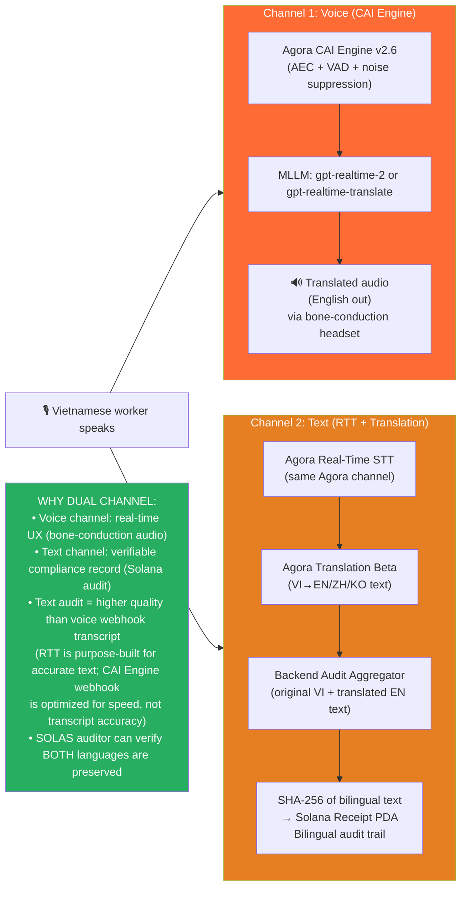
```mermaid
graph LR
    AUDIO["🎙️ Vietnamese worker speaks"]

    subgraph VOICE_CH ["Channel 1: Voice (CAI Engine)"]
        V1["`Agora CAI Engine v2.6
(AEC + VAD + noise suppression)`"]
        V2["MLLM: gpt-realtime-2 or gpt-realtime-translate"]
        V3["`🔊 Translated audio
(English out)
via bone-conduction headset`"]
        V1 --> V2 --> V3
    end

    subgraph TEXT_CH ["Channel 2: Text (RTT + Translation)"]
        T1["`Agora Real-Time STT
(same Agora channel)`"]
        T2["`Agora Translation Beta
(VI→EN/ZH/KO text)`"]
        T3["`Backend Audit Aggregator
(original VI + translated EN text)`"]
        T4["`SHA-256 of bilingual text
→ Solana Receipt PDA
Bilingual audit trail`"]
        T1 --> T2 --> T3 --> T4
    end

    AUDIO --> VOICE_CH
    AUDIO --> TEXT_CH

    WHY["`WHY DUAL CHANNEL:
• Voice channel: real-time UX (bone-conduction audio)
• Text channel: verifiable compliance record (Solana audit)
• Text audit = higher quality than voice webhook transcript
  (RTT is purpose-built for accurate text; CAI Engine webhook
   is optimized for speed, not transcript accuracy)
• SOLAS auditor can verify BOTH languages are preserved`"]

    style VOICE_CH fill:#FF6B35,color:#fff
    style TEXT_CH fill:#E67E22,color:#fff
    style WHY fill:#27AE60,color:#fff
```

### 2.3 Full Agora Product Map for WaveLens

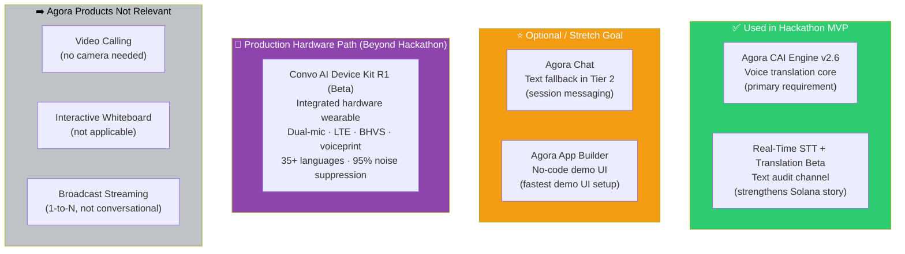
```mermaid
graph TD
    subgraph HACKATHON_USE ["✅ Used in Hackathon MVP"]
        CAI_E["`Agora CAI Engine v2.6
Voice translation core
(primary requirement)`"]
        RTT_T["`Real-Time STT + Translation Beta
Text audit channel
(strengthens Solana story)`"]
    end

    subgraph OPTIONAL_USE ["⭐ Optional / Stretch Goal"]
        CHAT_A["`Agora Chat
Text fallback in Tier 2
(session messaging)`"]
        APP_B["`Agora App Builder
No-code demo UI
(fastest demo UI setup)`"]
    end

    subgraph PRODUCTION_PATH ["🔮 Production Hardware Path (Beyond Hackathon)"]
        DEVKIT["`Convo AI Device Kit R1 (Beta)
Integrated hardware wearable
Dual-mic · LTE · BHVS · voiceprint
35+ languages · 95% noise suppression`"]
    end

    subgraph NOT_RELEVANT ["➡️ Agora Products Not Relevant"]
        VID["`Video Calling
(no camera needed)`"]
        WHITE["`Interactive Whiteboard
(not applicable)`"]
        STREAM["`Broadcast Streaming
(1-to-N, not conversational)`"]
    end

    style HACKATHON_USE fill:#2ECC71,color:#fff
    style OPTIONAL_USE fill:#F39C12,color:#fff
    style PRODUCTION_PATH fill:#8E44AD,color:#fff
    style NOT_RELEVANT fill:#BDC3C7,color:#000
```

---

## 3. AI Model Selection

### 3.1 Two Models, Two Purposes (Confirmed from OpenAI Docs)

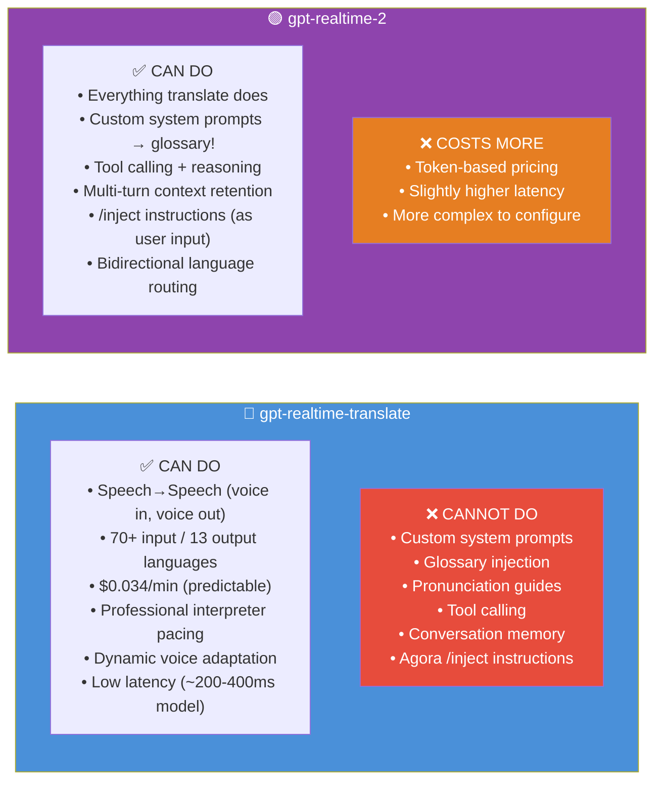
```mermaid
graph LR
    subgraph TRANSLATE ["🔵 gpt-realtime-translate"]
        T_YES["`✅ CAN DO
• Speech→Speech (voice in, voice out)
• 70+ input / 13 output languages
• $0.034/min (predictable)
• Professional interpreter pacing
• Dynamic voice adaptation
• Low latency (~200-400ms model)`"]
        T_NO["`❌ CANNOT DO
• Custom system prompts
• Glossary injection
• Pronunciation guides
• Tool calling
• Conversation memory
• Agora /inject instructions`"]
    end

    subgraph REALTIME2 ["🟣 gpt-realtime-2"]
        R_YES["`✅ CAN DO
• Everything translate does
• Custom system prompts → glossary!
• Tool calling + reasoning
• Multi-turn context retention
• /inject instructions (as user input)
• Bidirectional language routing`"]
        R_NO["`❌ COSTS MORE
• Token-based pricing
• Slightly higher latency
• More complex to configure`"]
    end

    style TRANSLATE fill:#4A90D9,color:#fff
    style REALTIME2 fill:#8E44AD,color:#fff
    style T_NO fill:#E74C3C,color:#fff
    style R_NO fill:#E67E22,color:#fff
```

### 3.2 Domain Routing — Which Model for Which Session

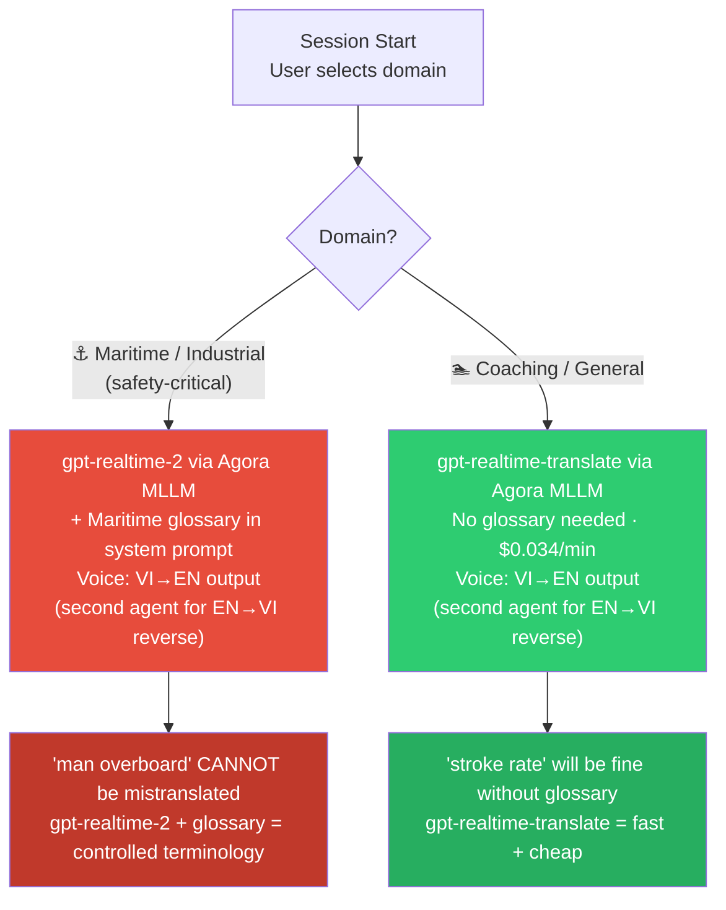
```mermaid
flowchart TD
    START["`Session Start
User selects domain`"] --> DOMAIN{"Domain?"}

    DOMAIN -->|"⚓ Maritime / Industrial<br/>(safety-critical)"| M["`gpt-realtime-2 via Agora MLLM
+ Maritime glossary in system prompt
Voice: VI→EN output
(second agent for EN→VI reverse)`"]
    DOMAIN -->|"🏊 Coaching / General"| C["`gpt-realtime-translate via Agora MLLM
No glossary needed · $0.034/min
Voice: VI→EN output
(second agent for EN→VI reverse)`"]

    M --> M_WHY["`'man overboard' CANNOT be mistranslated
gpt-realtime-2 + glossary = controlled terminology`"]
    C --> C_WHY["`'stroke rate' will be fine without glossary
gpt-realtime-translate = fast + cheap`"]

    style M fill:#E74C3C,color:#fff
    style C fill:#2ECC71,color:#fff
    style M_WHY fill:#C0392B,color:#fff
    style C_WHY fill:#27AE60,color:#fff
```

### 3.3 Bidirectional Translation — Two-Agent Pattern (Confirmed)

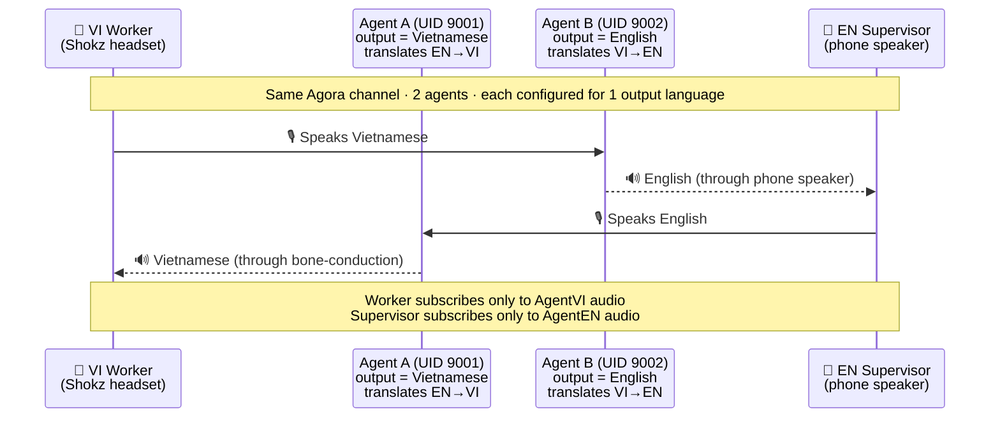
```mermaid
sequenceDiagram
%%{init: {"sequence": {"htmlLabels": true}} }%%
%%{init: {"sequence": {"htmlLabels": true}} }%%
    participant Worker as 👷 VI Worker<br>(Shokz headset)
    participant AgentVI as Agent A (UID 9001)<br>output = Vietnamese<br>translates EN→VI
    participant AgentEN as Agent B (UID 9002)<br>output = English<br>translates VI→EN
    participant Super as 👔 EN Supervisor<br>(phone speaker)

    Note over Worker,Super: Same Agora channel · 2 agents · each configured for 1 output language

    Worker->>AgentEN: 🎙️ Speaks Vietnamese
    AgentEN-->>Super: 🔊 English (through phone speaker)

    Super->>AgentVI: 🎙️ Speaks English
    AgentVI-->>Worker: 🔊 Vietnamese (through bone-conduction)

    Note over Worker,Super: Worker subscribes only to AgentVI audio<br>Supervisor subscribes only to AgentEN audio
```

### 3.3.1 ⚠️ Critical: Two-Agent Cross-Talk Problem

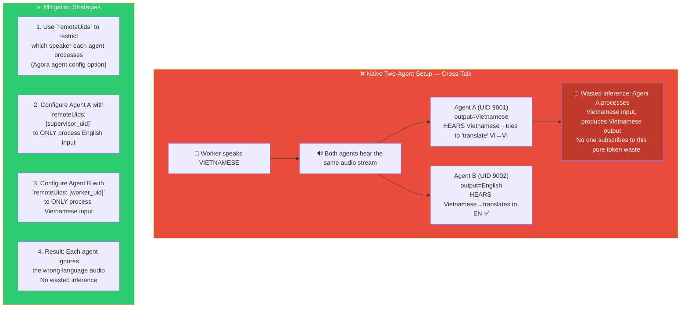
```mermaid
graph TD
    subgraph PROBLEM ["❌ Naive Two-Agent Setup — Cross-Talk"]
        WORKER_VI["👷 Worker speaks VIETNAMESE"]
        BOTH["🔊 Both agents hear the same audio stream"]
        AGENT_A["Agent A (UID 9001)<br/>output=Vietnamese<br/>HEARS Vietnamese→tries to 'translate' VI→VI"]
        AGENT_B["Agent B (UID 9002)<br/>output=English<br/>HEARS Vietnamese→translates to EN ✅"]
        WASTE["💸 Wasted inference: Agent A processes<br/>Vietnamese input, produces Vietnamese output<br/>No one subscribes to this — pure token waste"]
        WORKER_VI --> BOTH
        BOTH --> AGENT_A
        BOTH --> AGENT_B
        AGENT_A --> WASTE
    end

    subgraph SOLUTION ["✅ Mitigation Strategies"]
        S1["1. Use `remoteUids` to restrict<br/>which speaker each agent processes<br/>(Agora agent config option)"]
        S2["2. Configure Agent A with<br/>`remoteUids: [supervisor_uid]`<br/>to ONLY process English input"]
        S3["3. Configure Agent B with<br/>`remoteUids: [worker_uid]`<br/>to ONLY process Vietnamese input"]
        S4["4. Result: Each agent ignores<br/>the wrong-language audio<br/>No wasted inference"]
    end

    style PROBLEM fill:#E74C3C,color:#fff
    style WASTE fill:#C0392B,color:#fff
    style SOLUTION fill:#2ECC71,color:#fff
```

**Without `remoteUids` filtering**, both agents waste tokens processing audio in the language they're not meant to translate. This adds 200-400ms of unnecessary latency per turn and doubles your OpenAI token cost.

**Fix:** Set `remoteUids` on each agent to restrict which speaker UID it processes:
- Agent A (VI output): `remoteUids: [supervisor_uid]` — only processes English
- Agent B (EN output): `remoteUids: [worker_uid]` — only processes Vietnamese### 3.4 Confirmed Output Languages (13 — All Use Cases Covered)

Confirmed by OpenAI Cookbook, May 7, 2026:

**English · Chinese · Korean · Vietnamese · Spanish · Portuguese · French · Japanese · Russian · Hindi · Indonesian · Italian · German**

All three WaveLens target output languages (EN, ZH, KO) are confirmed. **Vietnamese is ALSO an output language** — supervisors speaking EN/KO/ZH can be heard in Vietnamese through the worker's bone-conduction headset.

### 3.5 Agora RTT Translation — Supported Languages (Broader Than OpenAI)

The Agora Real-Time STT Translation (Beta) supports **44 target languages** from the official docs, including:

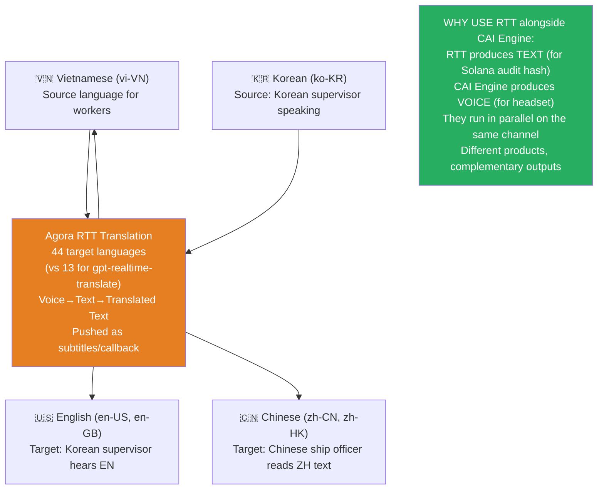
```mermaid
graph TD
    RTT_VI["`🇻🇳 Vietnamese (vi-VN)
Source language for workers`"]
    RTT_EN["`🇺🇸 English (en-US, en-GB)
Target: Korean supervisor hears EN`"]
    RTT_ZH["`🇨🇳 Chinese (zh-CN, zh-HK)
Target: Chinese ship officer reads ZH text`"]
    RTT_KO["`🇰🇷 Korean (ko-KR)
Source: Korean supervisor speaking`"]

    RTT_CORE["`Agora RTT Translation
44 target languages
(vs 13 for gpt-realtime-translate)
Voice→Text→Translated Text
Pushed as subtitles/callback`"]

    RTT_VI --> RTT_CORE
    RTT_KO --> RTT_CORE
    RTT_CORE --> RTT_EN
    RTT_CORE --> RTT_ZH
    RTT_CORE --> RTT_VI

    NOTE["`WHY USE RTT alongside CAI Engine:
RTT produces TEXT (for Solana audit hash)
CAI Engine produces VOICE (for headset)
They run in parallel on the same channel
Different products, complementary outputs`"]

    style RTT_CORE fill:#E67E22,color:#fff
    style NOTE fill:#27AE60,color:#fff
```

**RTT Translation latency** (from Agora docs): end-to-start under 1 second, average end-to-end under 3 seconds. This is too slow for real-time VOICE but perfectly fine for generating the text audit record.

---

## 4. Critical VAD Issue for Vietnamese

### 4.1 The Problem Hierarchy (Expanded)

Three layers of speaker isolation, from best to fallback:

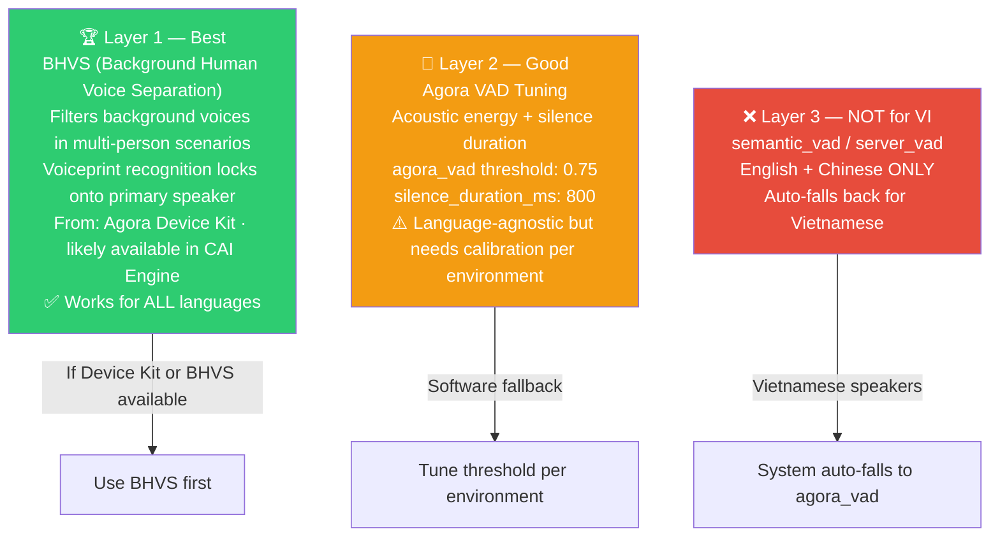
```mermaid
graph TD
    L1["`🏆 Layer 1 — Best
BHVS (Background Human Voice Separation)
Filters background voices in multi-person scenarios
Voiceprint recognition locks onto primary speaker
From: Agora Device Kit · likely available in CAI Engine
✅ Works for ALL languages`"]
    L2["`🥈 Layer 2 — Good
Agora VAD Tuning
Acoustic energy + silence duration
agora_vad threshold: 0.75
silence_duration_ms: 800
⚠️ Language-agnostic but needs calibration per environment`"]
    L3["`❌ Layer 3 — NOT for VI
semantic_vad / server_vad
English + Chinese ONLY
Auto-falls back for Vietnamese`"]

    L1 -->|"If Device Kit or BHVS available"| USE1["Use BHVS first"]
    L2 -->|"Software fallback"| USE2["Tune threshold per environment"]
    L3 -->|"Vietnamese speakers"| USE3["System auto-falls to agora_vad"]

    style L1 fill:#2ECC71,color:#fff
    style L2 fill:#F39C12,color:#fff
    style L3 fill:#E74C3C,color:#fff
```

### 4.2 BHVS and Voiceprint Recognition (From Agora Device Kit Docs)

**Background Human Voice Separation (BHVS):** Filters background voices in multi-person conversation scenarios — directly solving the problem of multiple port workers talking simultaneously while only one is intended for translation.

**Voiceprint recognition:** Locks onto the primary speaker in multi-person conversations. Once the worker's voice is registered, the system filters out other workers, crane operator chatter, and supervisors speaking in adjacent areas.

These algorithms run at the **Agora Convo AI Core level** — before audio even reaches the MLLM. For the hackathon:

- Configure `properties.audio.aec` and `properties.audio.ns` in the CAI Engine start call
- For BHVS-style isolation, use the voiceprint attention feature (available in some CAI Engine releases)

### 4.3 VAD Configuration by Environment

| Environment | Recommended Mode | Threshold | Silence Duration | Primary Challenge |
|---|---|---|---|---|
| Container port (crane noise) | agora_vad | 0.75 | 800ms | High ambient + multiple workers |
| Ship engine room | agora_vad | 0.80 | 900ms | Loudest; machine vibration triggers |
| Ship bridge/deck | agora_vad | 0.70 | 720ms | Wind gusts cause spikes |
| Poolside coaching | agora_vad | 0.60 | 640ms | Quiet; default-like settings fine |
| EN/KO/ZH supervisor (quiet office) | semantic_vad | n/a | n/a | Use smart VAD when available |

---

## 5. Session Flow

### 5.1 Dual-Channel Session Setup

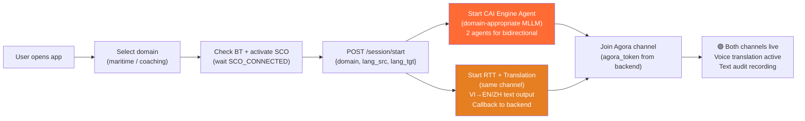
```mermaid
flowchart LR
    A["User opens app"] --> B["`Select domain
(maritime / coaching)`"]
    B --> C["`Check BT + activate SCO
(wait SCO_CONNECTED)`"]
    C --> D["`POST /session/start
{domain, lang_src, lang_tgt}`"]

    D --> VOICE["`Start CAI Engine Agent
(domain-appropriate MLLM)
2 agents for bidirectional`"]
    D --> TEXT["`Start RTT + Translation
(same channel)
VI→EN/ZH text output
Callback to backend`"]

    VOICE --> JOIN["`Join Agora channel
(agora_token from backend)`"]
    TEXT --> JOIN
    JOIN --> READY["`🟢 Both channels live
Voice translation active
Text audit recording`"]

    style VOICE fill:#FF6B35,color:#fff
    style TEXT fill:#E67E22,color:#fff
```

### 5.2 Full Conversational Turn — Sequence Diagram

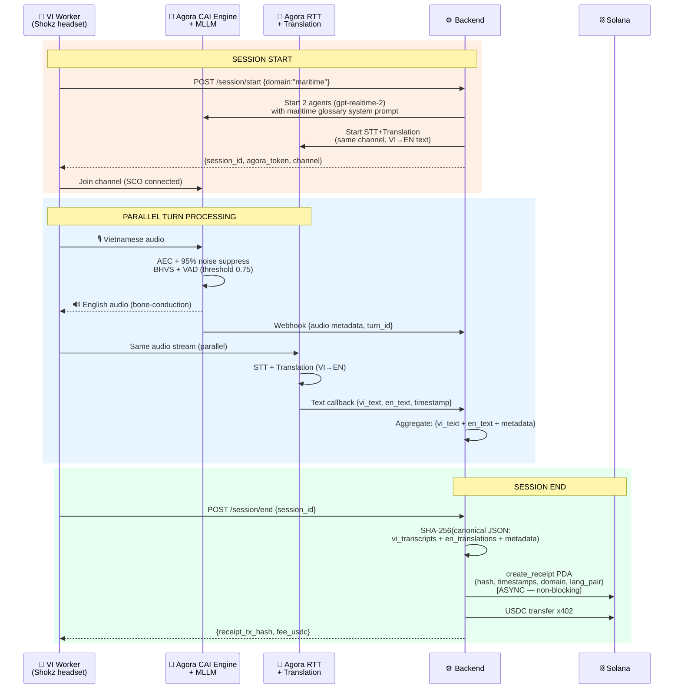
```mermaid
sequenceDiagram
%%{init: {"sequence": {"htmlLabels": true}} }%%
%%{init: {"sequence": {"htmlLabels": true}} }%%
    participant Worker as 👷 VI Worker<br>(Shokz headset)
    participant Agora_CAI as 🔴 Agora CAI Engine<br>+ MLLM
    participant Agora_RTT as 📝 Agora RTT<br>+ Translation
    participant Backend as ⚙️ Backend
    participant Solana as ⛓️ Solana

    rect rgb(255, 240, 230)
    Note over Worker,Backend: SESSION START
    Worker->>Backend: POST /session/start {domain:"maritime"}
    Backend->>Agora_CAI: Start 2 agents (gpt-realtime-2)<br/>with maritime glossary system prompt
    Backend->>Agora_RTT: Start STT+Translation<br/>(same channel, VI→EN text)
    Backend-->>Worker: {session_id, agora_token, channel}
    Worker->>Agora_CAI: Join channel (SCO connected)
    end

    rect rgb(230, 245, 255)
    Note over Worker,Agora_RTT: PARALLEL TURN PROCESSING
    Worker->>Agora_CAI: 🎙️ Vietnamese audio
    Agora_CAI->>Agora_CAI: AEC + 95% noise suppress<br/>BHVS + VAD (threshold 0.75)
    Agora_CAI-->>Worker: 🔊 English audio (bone-conduction)
    Agora_CAI->>Backend: Webhook {audio metadata, turn_id}

    Worker->>Agora_RTT: Same audio stream (parallel)
    Agora_RTT->>Agora_RTT: STT + Translation (VI→EN)
    Agora_RTT->>Backend: Text callback {vi_text, en_text, timestamp}
    Backend->>Backend: Aggregate: {vi_text + en_text + metadata}
    end

    rect rgb(230, 255, 240)
    Note over Backend,Solana: SESSION END
    Worker->>Backend: POST /session/end {session_id}
    Backend->>Backend: SHA-256(canonical JSON:<br/>vi_transcripts + en_translations + metadata)
    Backend->>Solana: create_receipt PDA<br/>(hash, timestamps, domain, lang_pair)<br/>[ASYNC — non-blocking]
    Backend->>Solana: USDC transfer x402
    Backend-->>Worker: {receipt_tx_hash, fee_usdc}
    end
```

### 5.3 What Goes into the Solana Hash

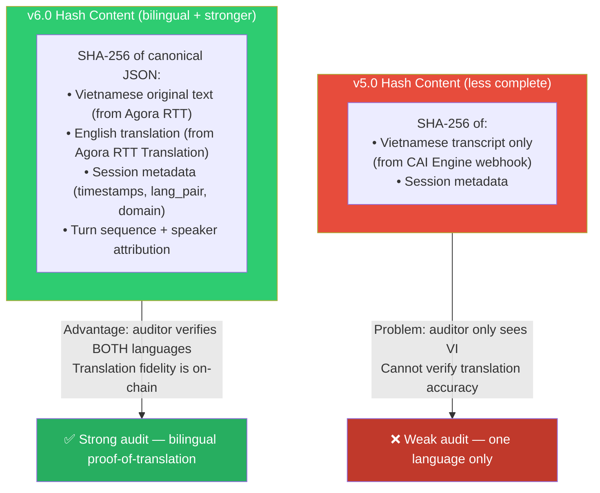
```mermaid
graph TD
    subgraph OLD ["v5.0 Hash Content (less complete)"]
        O1["`SHA-256 of:
• Vietnamese transcript only
  (from CAI Engine webhook)
• Session metadata`"]
    end

    subgraph NEW ["v6.0 Hash Content (bilingual + stronger)"]
        N1["`SHA-256 of canonical JSON:
• Vietnamese original text (from Agora RTT)
• English translation (from Agora RTT Translation)
• Session metadata (timestamps, lang_pair, domain)
• Turn sequence + speaker attribution`"]
    end

    OLD -->|"Problem: auditor only sees VI<br/>Cannot verify translation accuracy"| PROBLEM["❌ Weak audit — one language only"]
    NEW -->|"Advantage: auditor verifies BOTH languages<br/>Translation fidelity is on-chain"| STRENGTH["✅ Strong audit — bilingual proof-of-translation"]

    style OLD fill:#E74C3C,color:#fff
    style NEW fill:#2ECC71,color:#fff
    style PROBLEM fill:#C0392B,color:#fff
    style STRENGTH fill:#27AE60,color:#fff
```

### 5.4 Offline Tier Selection (Unchanged — Confirmed Sound)

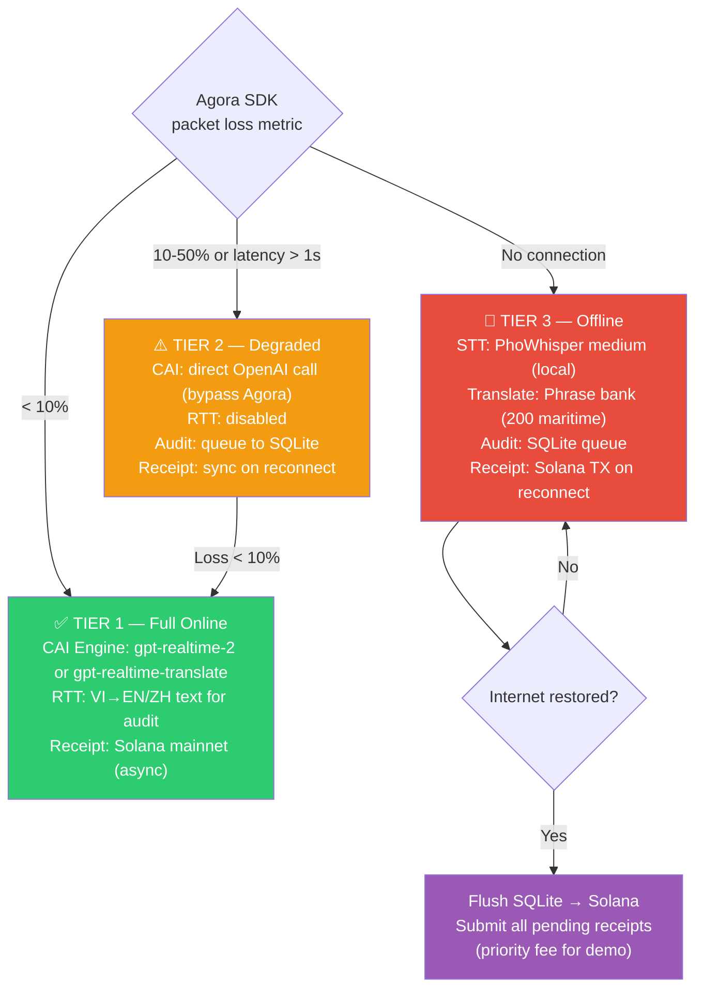
```mermaid
flowchart TD
    CHECK{"Agora SDK<br/>packet loss metric"} -->|"< 10%"| T1
    CHECK -->|"10-50% or latency > 1s"| T2
    CHECK -->|"No connection"| T3

    T1["`✅ TIER 1 — Full Online
CAI Engine: gpt-realtime-2 or gpt-realtime-translate
RTT: VI→EN/ZH text for audit
Receipt: Solana mainnet (async)`"]

    T2["`⚠️ TIER 2 — Degraded
CAI: direct OpenAI call (bypass Agora)
RTT: disabled
Audit: queue to SQLite
Receipt: sync on reconnect`"]

    T3["`🔴 TIER 3 — Offline
STT: PhoWhisper medium (local)
Translate: Phrase bank (200 maritime)
Audit: SQLite queue
Receipt: Solana TX on reconnect`"]

    T3 --> SYNC{"Internet restored?"}
    SYNC -->|"Yes"| FLUSH["`Flush SQLite → Solana
Submit all pending receipts
(priority fee for demo)`"]
    SYNC -->|"No"| T3
    T2 -->|"Loss < 10%"| T1

    style T1 fill:#2ECC71,color:#fff
    style T2 fill:#F39C12,color:#fff
    style T3 fill:#E74C3C,color:#fff
    style FLUSH fill:#9B59B6,color:#fff
```

---

## 6. Solana Integration

### 6.1 Finality Timeline

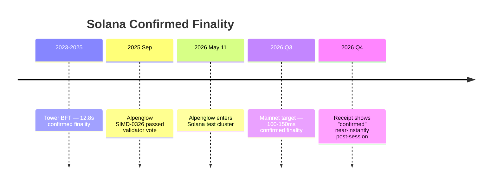
```mermaid
timeline
    title Solana Confirmed Finality
    2023-2025 : Tower BFT — 12.8s confirmed finality
    2025 Sep : Alpenglow SIMD-0326 passed validator vote
    2026 May 11 : Alpenglow enters Solana test cluster
    2026 Q3 : Mainnet target — 100-150ms confirmed finality
    2026 Q4 : Receipt shows "confirmed" near-instantly post-session
```

Receipts are async by design — no code changes needed when Alpenglow ships to mainnet.

### 6.2 Two-Account Architecture

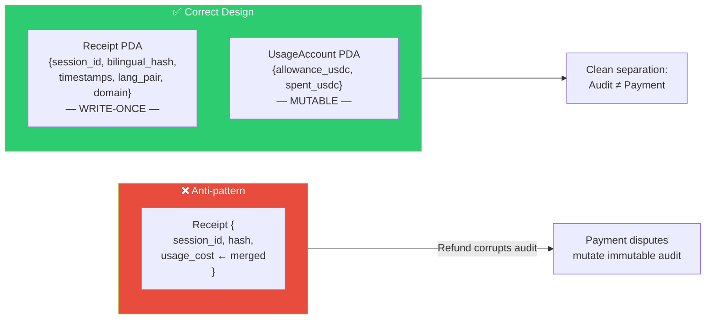
```mermaid
graph LR
    subgraph WRONG ["❌ Anti-pattern"]
        WR["`Receipt {
session_id, hash,
usage_cost ← merged
}`"]
    end

    subgraph RIGHT ["✅ Correct Design"]
        R1["`Receipt PDA
{session_id, bilingual_hash,
timestamps, lang_pair, domain}
— WRITE-ONCE —`"]
        R2["`UsageAccount PDA
{allowance_usdc, spent_usdc}
— MUTABLE —`"]
    end

    WRONG -->|"Refund corrupts audit"| PROBLEM["`Payment disputes
mutate immutable audit`"]
    RIGHT --> OK["`Clean separation:
Audit ≠ Payment`"]

    style WRONG fill:#E74C3C,color:#fff
    style RIGHT fill:#2ECC71,color:#fff
```

### 6.3 Payment Flow — x402 Pattern

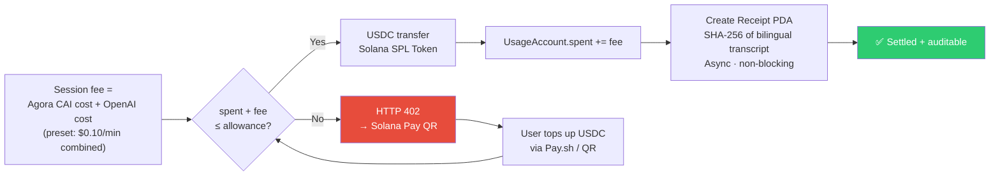
```mermaid
flowchart LR
    FEE["`Session fee =
Agora CAI cost + OpenAI cost
(preset: $0.10/min combined)`"] --> CHECK{"spent + fee<br/>≤ allowance?"}
    CHECK -->|"Yes"| TRANSFER["`USDC transfer
Solana SPL Token`"]
    CHECK -->|"No"| HTTP402["`HTTP 402
→ Solana Pay QR`"]
    TRANSFER --> UPDATE["UsageAccount.spent += fee"]
    UPDATE --> REC["`Create Receipt PDA
SHA-256 of bilingual transcript
Async · non-blocking`"]
    REC --> DONE["✅ Settled + auditable"]
    HTTP402 --> QR["`User tops up USDC
via Pay.sh / QR`"]
    QR --> CHECK

    style DONE fill:#2ECC71,color:#fff
    style HTTP402 fill:#E74C3C,color:#fff
```

### 6.4 SOLAS Audit Flow (Strengthened with Bilingual Hash)

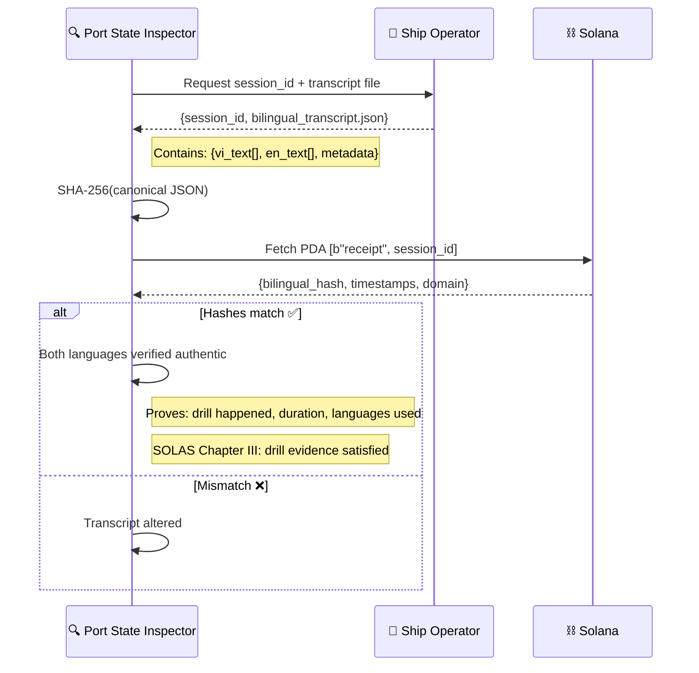
```mermaid
sequenceDiagram
%%{init: {"sequence": {"htmlLabels": true}} }%%
%%{init: {"sequence": {"htmlLabels": true}} }%%
    participant Inspector as 🔍 Port State Inspector
    participant Operator as 🏢 Ship Operator
    participant Solana as ⛓️ Solana

    Inspector->>Operator: Request session_id + transcript file
    Operator-->>Inspector: {session_id, bilingual_transcript.json}
    Note right of Inspector: Contains: {vi_text[], en_text[], metadata}

    Inspector->>Inspector: SHA-256(canonical JSON)
    Inspector->>Solana: Fetch PDA [b"receipt", session_id]
    Solana-->>Inspector: {bilingual_hash, timestamps, domain}

    alt Hashes match ✅
        Inspector->>Inspector: Both languages verified authentic
        Note right of Inspector: Proves: drill happened, duration, languages used
        Note right of Inspector: SOLAS Chapter III: drill evidence satisfied
    else Mismatch ❌
        Inspector->>Inspector: Transcript altered
    end
```

---

## 7. Hardware Integration

### 7.1 Hackathon Hardware — Shokz for Demo Day

| Use Case | Model | IP | BT Codec | Notes |
|---|---|---|---|---|
| Port/ship worker | **Shokz OpenRun Pro 2** | IP55 | SBC only (50-100ms) | Loudest bone-conduction; AI mic NC |
| Supervisor (demo) | Phone speaker | — | — | Sufficient for demo; judges hear EN output |
| Aquatic coaching | Shokz OpenSwim Pro | IP68 | SBC | BT above water only |

**Hardware warning:** The OpenRun Pro 2 supports SBC codec only. No aptX, no aptX-LL. Plan for 50-100ms Bluetooth latency, not 20-40ms.

### 7.2 Android SCO Routing — Mandatory for Any Bone-Conduction Headset

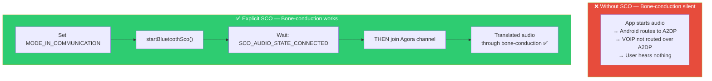
```mermaid
flowchart TD
    subgraph WRONG ["❌ Without SCO — Bone-conduction silent"]
        W1["`App starts audio
→ Android routes to A2DP
→ VOIP not routed over A2DP
→ User hears nothing`"]
    end

    subgraph RIGHT ["✅ Explicit SCO — Bone-conduction works"]
        R1["Set MODE_IN_COMMUNICATION"] --> R2["startBluetoothSco()"]
        R2 --> R3["Wait: SCO_AUDIO_STATE_CONNECTED"]
        R3 --> R4["THEN join Agora channel"]
        R4 --> R5["`Translated audio
through bone-conduction ✅`"]
    end

    style WRONG fill:#E74C3C,color:#fff
    style RIGHT fill:#2ECC71,color:#fff
```

**Agora SDK with SCO:** Use `AUDIO_PROFILE_SPEECH_STANDARD` + `AUDIO_SCENARIO_DEFAULT`. Never use `MUSIC_HIGH_QUALITY` — conflicts with SCO.

### 7.2.1 ⚠️ Android OEM SCO Compatibility (Known Issues)

| OEM | SCO Behavior | Notes |
|---|---|---|
| **Samsung** | ✅ Generally reliable | May need `BluetoothAdapter.getProfileConnectionState()` check before SCO |
| **Xiaomi** | ⚠️ Intermittent | MIUI optimizations can kill SCO after 30s; needs wake lock |
| **Oppo/Realme** | ⚠️ Inconsistent | ColorOS battery saver disconnects SCO; add `FOREGROUND_SERVICE` |
| **Google Pixel** | ✅ Most reliable | Stock Android behaves as documented |
| **Huawei** | ❌ Problematic | EMUI blocks SCO in non-VOIP apps; may need HMS integration |
| **Vivo** | ⚠️ Untested | Not verified — test before Demo Day |

**Hackathon recommendation:**
1. **Test with the EXACT phone + Shokz pair** you'll use on Demo Day
2. Keep a **wired USB-C headphone + mic dongle** as backup (avoids SCO entirely)
3. If SCO fails, **fall back to phone speaker + subtitles** — the subtitle UI works with any audio output
4. Use Android's `AudioManager.setParameters("BT_SCO=ON")` as additional fallback for stubborn devices

### 7.3 Production Hardware Path — Convo AI Device Kit R1 (NEW)

This is the most significant find from reading Agora's live docs. It completely changes the production hardware story for WaveLens.

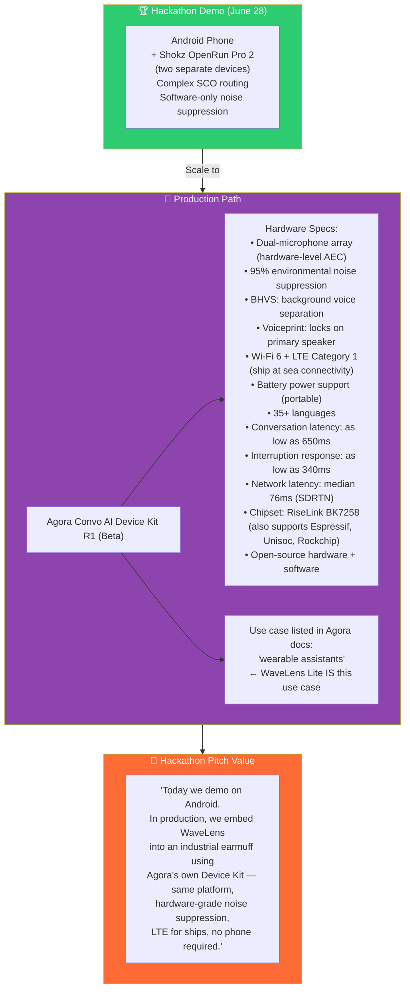
```mermaid
graph TD
    subgraph DEMO ["🏆 Hackathon Demo (June 28)"]
        ANDROID["`Android Phone
+ Shokz OpenRun Pro 2
(two separate devices)
Complex SCO routing
Software-only noise suppression`"]
    end

    subgraph PRODUCTION ["🔮 Production Path"]
        DK["Agora Convo AI Device Kit R1 (Beta)"]

        DK_SPECS["`Hardware Specs:
• Dual-microphone array
  (hardware-level AEC)
• 95% environmental noise suppression
• BHVS: background voice separation
• Voiceprint: locks on primary speaker
• Wi-Fi 6 + LTE Category 1
  (ship at sea connectivity)
• Battery power support (portable)
• 35+ languages
• Conversation latency: as low as 650ms
• Interruption response: as low as 340ms
• Network latency: median 76ms (SDRTN)
• Chipset: RiseLink BK7258
  (also supports Espressif, Unisoc, Rockchip)
• Open-source hardware + software`"]

        DK_USE["`Use case listed in Agora docs:
'wearable assistants'
← WaveLens Lite IS this use case`"]

        DK --> DK_SPECS
        DK --> DK_USE
    end

    subgraph PITCH ["🎯 Hackathon Pitch Value"]
        P1["`'Today we demo on Android.
In production, we embed WaveLens
into an industrial earmuff using
Agora's own Device Kit — same platform,
hardware-grade noise suppression,
LTE for ships, no phone required.'`"]
    end

    DEMO -->|"Scale to"| PRODUCTION
    PRODUCTION --> PITCH

    style DEMO fill:#2ECC71,color:#fff
    style PRODUCTION fill:#8E44AD,color:#fff
    style PITCH fill:#FF6B35,color:#fff
```

**Why Device Kit solves the Bluetooth problem permanently:** The Device Kit has a dual-microphone array with HARDWARE-level AEC. There is no Bluetooth SCO routing problem — the device captures, processes, and outputs audio natively. The bone-conduction output becomes a speaker directly integrated in the wearable.

**For the hackathon:** You cannot build a Device Kit prototype in 9 days. But you should have a slide showing the production path with the Device Kit architecture. Judges who know Agora's product line will be impressed.

---

## 8. Latency Budget (Updated with Official Device Kit Specs)

### 8.1 Verified Performance Numbers (From Live Agora Docs)

| Metric | Hackathon (Android + Shokz) | Production (Device Kit) | Source |
|---|---|---|---|
| Conversation latency | ~670ms P50 | **As low as 650ms** | Agora Device Kit docs |
| Interruption response | ~340ms | **As low as 340ms** | Agora Device Kit docs |
| SDRTN network latency | 80-120ms | **Median 76ms** | Agora Device Kit docs |
| Noise suppression | Software, ~80dB | **Hardware, 95% of noise** | Agora Device Kit docs |
| Packet loss tolerance | 80% | 80% | Both confirmed |
| BT codec latency | SBC: 50-100ms | None (integrated) | Hardware |

### 8.2 Latency Breakdown — Hackathon Android Path

| Pipeline Step | P50 (Coaching) | P50 (Maritime) | P95 (100dB Noise) |
| :--- | :--- | :--- | :--- |
| **Agora SDRTN + VAD** | 120ms | 120ms | 200ms |
| **Model Inference** | 280ms (Translation) | 380ms (Transl. + Reason) | 600ms |
| **Audio Delivery** | 80ms | 80ms | 150ms |
| **Bluetooth SBC** | 75ms | 90ms | 150ms |
| **Total E2E Latency** | **555ms** | **670ms** | **1,100ms** |

**Target:** "Under 1.5 seconds for 90% of turns" — achievable in normal conditions.

### 8.3 ⚠️ Important Caveats on Latency Numbers

The latency numbers above are **estimated targets, not validated measurements.** Real-world factors will increase latency:

| Factor | Impact | Why |
|---|---|---|
| **Glossary injection** | +100-200ms | gpt-realtime-2 with glossary has larger prompt → higher TTFT |
| **Network jitter** | +50-150ms | University WiFi, 4G hotspots add variability |
| **SCO/BT reconnection** | +200-1000ms | First turn after SCO connect often has extra delay |
| **Agora VAD tuning** | +100-300ms | High-noise environments push VAD detection time up |
| **Dual-channel overhead** | +0-200ms | RTT running in parallel consumes channel bandwidth |

**Recommendation:** Measure actual latency with the exact demo hardware (Shokz + Android phone) on university WiFi during load testing before Demo Day. Use the Agora `AGENT_METRICS` event and browser-side console timestamps.

---

## 9. Hackathon Build Plan — 9 Days

### 9.1 Priority Timeline

### 9.2 TEN Framework — Hackathon Accelerator (NEW)

**Agora's TEN Framework** (open-source, 6,000 GitHub stars) is a multimodal conversational AI pipeline framework. It provides pre-built components for STT → LLM → TTS pipelines. For the hackathon backend:

```mermaid
graph LR
    TEN["`Agora TEN Framework
(open-source)
github.com/TEN-framework`"]
    TEN --> USE["`Hackathon use:
• Pre-built pipeline components
• STT → LLM → TTS connectors
• OpenAI + Gemini extensions built-in
• Python agent framework
• Saves 1-2 days of backend plumbing`"]
    TEN --> LIMIT["`Limitations:
• Learning curve
• Different from CAI Engine REST API approach
• Evaluate Day 1: use if team has Python experience,
  fall back to direct FastAPI if not`"]

    style TEN fill:#FF6B35,color:#fff
    style USE fill:#2ECC71,color:#fff
    style LIMIT fill:#E67E22,color:#fff
```

### 9.3 Cut vs Keep for 9-Day Build

```mermaid
graph LR
    subgraph MUST ["✅ Ship for Demo Day — Non-negotiable"]
        K1["`VI→EN live voice translation
(gpt-realtime-translate)
The core wow moment`"]
        K2["`Shokz bone-conduction
on real hardware`"]
        K3["`Maritime glossary
gpt-realtime-2 session type
Safety terminology signal`"]
        K4["`Solana receipt TX
on explorer
Web3 proof`"]
        K5["`Agora RTT text
feed into audit hash
Cleaner Solana story`"]
    end

    subgraph CUT ["❌ Cut for Hackathon"]
        C1["`Tier 3 offline PhoWhisper
(save for pitch)`"]
        C2["`Full bidirectional EN→VI
(explain architecture · demo VI→EN only)`"]
        C3["`Three language pairs
(VI→EN is enough to win)`"]
        C4["`Device Kit hardware prototype
(show slide only)`"]
    end

    subgraph BONUS ["⭐ Bonus If Time Allows"]
        B1["`EN→VI second agent
reverse direction demo`"]
        B2["`Device Kit production slide
in pitch deck`"]
        B3["`Agora App Builder
no-code demo UI`"]
    end

    style MUST fill:#2ECC71,color:#fff
    style CUT fill:#E74C3C,color:#fff
    style BONUS fill:#F39C12,color:#fff
```

### 9.4 Demo Day Narrative (June 28, ĐH Bách Khoa Đà Nẵng)

**Opening hook (30 seconds):**
> "Da Nang Port is targeting 16.77 million tonnes in 2026. On every shift, a Vietnamese crane operator and a Korean ship officer work alongside each other through hand signals and guesswork. Walkie-talkies don't translate. Phones need hands. In-ear headphones block safety alarms. We built WaveLens Lite: voice-to-voice translation through bone conduction — so the operator hears the translation without blocking their ears, and both hands stay on the crane."

**Live demo (4 minutes):**

1. Show Shokz OpenRun Pro 2 — explain bone conduction in one sentence
2. Select "Maritime" domain → glossary loads (show the term list briefly)
3. Speak Vietnamese → English plays through phone speaker for the "supervisor"
4. Say "két ballast đang rò rỉ" → show "ballast tank is leaking" in the transcript UI
5. Open Solana explorer → show the receipt TX with the bilingual hash
6. Show Agora dashboard → session agent activity

**Three judge questions answered before they ask:**

- "Why Agora?" → 80% packet loss tolerance. Without it, crane yards with 40% radio congestion make translation fail. Raw WebRTC cannot do this.
- "Why Solana?" → SOLAS maritime law requires evidence of safety drills. An immutable on-chain hash of the bilingual transcript gives port state inspectors verifiable proof without storing any crew PII.
- "What's the production path?" → Agora already ships the Device Kit R1 for exactly this: a wearable with hardware-grade noise suppression, LTE for ships, and Agora's full AI pipeline embedded. Today we demo on Android; production deploys on the Device Kit.

---

## 10. Testing Strategy

### 10.1 Pre-Demo Validation Checklist

| Test | Method | Pass Criteria | Who |
|---|---|---|---|
| **Voice translation latency** | Record audio + console timestamps via `AGENT_METRICS` | P50 < 1.5s, P90 < 3s | Dev |
| **VAD accuracy (Vietnamese)** | Play recorded port noise through speaker, speak Vietnamese phrases | Turn detection starts within 500ms, no early cutoff | Dev |
| **SCO routing** | Connect Shokz OpenRun Pro 2, run translator session, verify audio output | Audio plays through bone-conduction within 5s of session start | All |
| **Bidirectional translation** | Worker speaks VI → verify EN output. Supervisor speaks EN → verify VI output | Both directions produce accurate translations of test phrases | Dev |
| **Maritime glossary** | Speak "két ballast đang rò rỉ" in maritime mode | Output: "ballast tank is leaking" (not a mistranslation) | Dev |
| **Solana receipt** | Complete a session, check Solana explorer for receipt TX | TX visible on explorer with correct SHA-256 hash | Dev |
| **University WiFi simulation** | Run session with bandwidth throttling (Chrome DevTools: 3G preset) | Voice translation continues with < 50% packet loss | All |
| **RTT text fallback** | Disable CAI Engine, verify text-only mode works | Text translation appears within 5s | Dev |
| **API rate limit** | Start 3 sessions in 1 minute | No 429 errors from OpenAI or Agora | Dev |
| **Battery endurance** | Run continuous translation for 30 minutes | No crash, audio quality doesn't degrade | All |

### 10.2 Latency Measurement Protocol

```mermaid
flowchart LR
    T1["1. Open Chrome DevTools<br/>on Android device"] --> T2["2. Run translator session<br/>with demo hardware"]
    T2 --> T3["3. Speak test phrase<br/>with stopwatch visible"]
    T3 --> T4["4. Note time from<br/>mouth movement to<br/>headphone audio"]
    T4 --> T5["5. Compare with<br/>AGENT_METRICS values"]
    T5 --> T6["6. Record in test log<br/>(min 10 samples per environment)"]
```

**Test phrases (record these for reproducibility):**
- *VI:* "Cần cẩu số 2 đang nâng container" → *EN:* "Crane number 2 is lifting the container"
- *VI:* "Trạm tập hợp ở boong chính" → *EN:* "Muster station is on the main deck"
- *EN:* "Stop the engine immediately" → *VI:* "Dừng máy ngay lập tức"
- *VI:* "Áp suất két ballast đang tăng" → *EN:* "Ballast tank pressure is increasing"

### 10.3 Environments to Test

1. **Controlled (quiet room)** — Baseline latency, no noise interference
2. **Simulated port noise** — Play 85dB crane/engine recording from speaker
3. **University hall (Demo Day)** — Test at actual venue 1 day before if possible
4. **Outdoor (wind)** — Test SCO + mic with light wind exposure
5. **4G hotspot** — Test with phone hotspot, not venue WiFi (backup plan)

### 10.4 What to Do When a Test Fails

| Failure | Immediate Action | Contingency for Demo Day |
|---|---|---|
| VAD cuts off Vietnamese | Lower threshold to 0.6, increase silence to 1000ms | Pre-record demo video |
| SCO silent | Restart app, re-pair Shokz, try different USB port | Demo with phone speaker + show subtitle |
| Glossary term mistranslated | Switch to gpt-realtime-translate (no glossary) | Skip maritime demo, show coaching demo |
| Solana TX stuck | Wait 30s, if still pending show "TX submitted" state | Show screenshot of successful TX |
| WiFi drops | Switch to 4G hotspot immediately | Hotspot must be ready before demo starts |

---

## 11. Risk Assessment

```mermaid
quadrantChart
    title Risk Matrix — Likelihood vs Impact
    x-axis Low Likelihood --> High Likelihood
    y-axis Low Impact --> High Impact
    quadrant-1 Manage Actively
    quadrant-2 Watch Closely
    quadrant-3 Accept
    quadrant-4 Mitigate First

    VAD false triggers on VI in port noise: [0.80, 0.85]
    RTT + CAI both fail simultaneously: [0.15, 0.65]
    OpenRun Pro 2 volume at 100dB: [0.65, 0.80]
    University WiFi at Demo Day: [0.55, 0.75]
    Agora Vietnam datacenter latency: [0.35, 0.70]
    OpenAI rate limits at demo: [0.20, 0.80]
    SCO connect fails on firmware: [0.45, 0.55]
    Solana TX slow at demo: [0.30, 0.45]
    RTT translation latency slows audit: [0.35, 0.20]
```

| Risk | Mitigation |
|---|---|
| **University WiFi failure** | **Bring 4G/5G hotspot. Non-negotiable.** |
| **VAD false triggers on VI in industrial noise** | Tune threshold=0.75, silence=800ms. Test on recorded port audio. |
| **OpenRun Pro 2 too quiet at 100dB** | OpenRun Pro 2 is loudest in class. Test in real loud environment before June 28. |
| **OpenAI rate limits at demo** | Pre-warm session before judges arrive. Gemini Live configured as hot fallback in Agora v2.6. |
| **SCO connect fails** | Test on the exact Shokz unit used for demo. Keep wired earphone as emergency audio proof. |
| **RTT text lags (3s)** | RTT runs async — receipt hash is computed post-session. No user-facing impact during demo. |
| **Solana TX slow** | Receipts are async. Add priority fee for demo sessions. Show "pending" state as expected. |

### 11.5 Live Demo Contingency Plan

Every demo step has a known failure mode. Prepare each backup BEFORE Demo Day.

```mermaid
graph TD
    subgraph CONTINGENCY ["🚨 Demo Day Contingencies"]
        WIFI["WiFi Fails"] --> HOTSPOT["4G/5G hotspot ready<br/>Tested with hardware"]
        SCO["SCO Silent"] --> SPEAKER["Phone speaker fallback<br/>Subtitle text always visible"]
        API_RATE["OpenAI rate limited"] --> GEMINI["Hot-switch to Gemini Live<br/>(pre-configured in Agora console)"]
        CRASH["App crashes"] --> VIDEO["Pre-recorded demo video<br/>on separate phone"]
        QUIET["Shokz too quiet<br/>in 100dB hall"] --> CAPTION["Subtitles are primary output<br/>Audio is secondary"]
        FORGET["Forget demo script"] --> CHEAT_SHEET["Cheat sheet taped to table<br/>1-sentence per step"]
    end

    style CONTINGENCY fill:#E74C3C,color:#fff
    style HOTSPOT fill:#2ECC71,color:#fff
    style SPEAKER fill:#F39C12,color:#fff
    style GEMINI fill:#3498DB,color:#fff
    style VIDEO fill:#9B59B6,color:#fff
    style CAPTION fill:#1ABC9C,color:#fff
    style CHEAT_SHEET fill:#E67E22,color:#fff
```

**Non-negotiable backups to prepare 1 day before:**
1. **📱 Second phone** with same app installed + logged in
2. **📹 Video recording** of full demo flow (phone screen recording + external mic)
3. **📝 Screenshots** of Solana explorer, Agora dashboard, transcript UI
4. **🔋 Power bank** + USB-C cable for each device
5. **🌐 4G/5G hotspot** tested with the exact Shokz + phone setup
6. **📄 Cheat sheet** with: test phrases, click sequence, backup plan trigger conditions

---

## 12. Production Roadmap

```mermaid
graph TD
    MVP["`🏆 Hackathon MVP
(June 28)`"]

    MVP --> P1["`Deploy on Agora Device Kit R1
Dual-mic + LTE + hardware AEC
No phone required
Wearable form factor for industrial`"]
    MVP --> P2["`SOLAS/IMO formal legal review
Bilingual audit trail design
Port state control acceptance`"]
    MVP --> P3["`Fine-tune PhoWhisper
On maritime vocabulary
50-100h domain audio`"]
    MVP --> P4["`Shokz enterprise or
iFlytek hardware partner`"]
    MVP --> P5["`Group broadcast mode
1 supervisor → N workers
Agora multi-audience channel`"]
    MVP --> P6["`Wake-word / PTT mode
Avoid false triggers
in 100dB continuous ops`"]
    MVP --> P7["`Alpenglow upgrade Q3 2026
Receipt confirmed in 150ms
No code changes needed`"]
    MVP --> P8["`gpt-realtime-translate
glossary support watch
(OpenAI roadmap — could simplify
maritime routing if added)`"]

    style MVP fill:#FF6B35,color:#fff
    style P1 fill:#8E44AD,color:#fff
    style P2 fill:#9B59B6,color:#fff
    style P7 fill:#3498DB,color:#fff
```

---

## Appendix A: Library Versions (June 2026 — Live Docs Verified)

| Library | Version | Critical Note |
|---|---|---|
| Agora Voice SDK (Android) | 4.5.x | Confirm latest at docs.agora.io/en/sdks |
| **Agora CAI REST API** | **v2** (engine v2.6) | Path: `/api/conversational-ai-agent/v2/` |
| **Agora RTT API** | v7.x | Path: `/api/speech-to-text/v1/` |
| **OpenAI — maritime** | `gpt-realtime-2` | Supports system prompt + glossary |
| **OpenAI — coaching** | `gpt-realtime-translate` | No custom prompts; $0.034/min |
| **Agora input transcription** | `gpt-4o-transcribe` | Use language hint "vi" for Vietnamese |
| Anchor (Solana) | 0.31.x | Use AVM (Anchor Version Manager) |
| **Solana Web3.js** | **2.x** | Breaking from 1.x — always use 2.x |
| @solana/spl-token | 0.4.x | USDC SPL token transfers |
| **PhoWhisper** | medium | github.com/VinAIResearch/PhoWhisper — Tier 3 only |
| FastAPI | 0.115.x | Async webhook handlers |
| Redis (aioredis) | 2.x | Session state, 24h TTL |

---

## Appendix B: Maritime Glossary (Priority Order)

| Vietnamese | English | Korean | Chinese | Priority |
|---|---|---|---|---|
| người rơi xuống biển | man overboard | 남자가 떨어짐 | 人员落水 | 🔴 CRITICAL |
| Bộ luật ISPS | ISPS code | ISPS 코드 | ISPS规则 | 🔴 CRITICAL |
| két ballast | ballast tank | 밸러스트 탱크 | 压载水舱 | 🟠 HIGH |
| bơm bi-lơ | bilge pump | 빌지 펌프 | 污水泵 | 🟠 HIGH |
| cần cẩu cổng | gantry crane | 갠트리 크레인 | 门式起重机 | 🟠 HIGH |
| trạm tập hợp | muster station | 집합소 | 集合站 | 🟠 HIGH |
| xả đáy | blow-down | 블로우다운 | 排污 | 🟡 MED |

---

## Appendix C: Why Each Technical Choice

```mermaid
graph TD
    Q1{"Why Agora CAI<br/>not raw WebRTC?"}
    Q2{"Why gpt-realtime-2<br/>for maritime?"}
    Q3{"Why RTT<br/>for text audit?"}
    Q4{"Why Solana<br/>not Ethereum?"}
    Q5{"Why USDC<br/>not SOL?"}

    A1["`80% packet loss tolerance
Craneyard radio: ~40% congestion
Raw WebRTC degrades at ~20%
Agora = non-negotiable for industrial`"]
    A2["`ONLY model supporting custom prompts
gpt-realtime-translate cannot inject glossary
'Man overboard' must be exact
Safety = not left to chance`"]
    A3["`RTT produces accurate text (designed for it)
CAI Engine webhook optimized for speed not accuracy
Bilingual text in hash = auditor verifies translation
Separate Agora product = no added latency to voice`"]
    A4["`Solana: $0.0005/TX · sub-second slot
Ethereum L1: $5-50/TX · 12s blocks
x402 standard is Solana-native
Pay.sh (Google Cloud) validates choice`"]
    A5["`SOL volatility makes fee unstable
$0.10/min fixed in USDC is user-understandable
USDC on Solana dominant for agentic payments`"]

    Q1 --> A1
    Q2 --> A2
    Q3 --> A3
    Q4 --> A4
    Q5 --> A5

    style A1 fill:#FF6B35,color:#fff
    style A2 fill:#E74C3C,color:#fff
    style A3 fill:#E67E22,color:#fff
    style A4 fill:#9B59B6,color:#fff
    style A5 fill:#9B59B6,color:#fff
```

---

## Appendix D: Agora Cost Model

| Component | Free Quota | Paid Rate | $600 Credits = |
|---|---|---|---|
| CAI Engine (Agora preset key) | 300 min/month | $0.10/min | 6,000 minutes |
| Real-Time STT + Translation | 300 min/month (shared with CAI) | ~$0.01/min (STT) + LLM cost | Large buffer |
| Agora RTC audio | 10,000 min/month | $0.99/1,000 min | Essentially free |

**For the hackathon:** At 10 minutes per test session, the 300 free CAI minutes = 30 test sessions before credits activate. $600 credits give 6,000 more minutes. A team doing 3 sessions/day for 9 days uses 270 minutes — well within the free tier alone.

### OpenAI Cost Model (Not Covered by Agora Credits)

| Model | Pricing | 10-min Session Cost | 100 Sessions Cost |
|---|---|---|---|
| **gpt-realtime-translate** (coaching) | $0.034/min | $0.34 | $34.00 |
| **gpt-realtime-2** (maritime, with glossary) | Token-based ~$0.06-0.10/min | $0.60-1.00 | $60-100 |
| **gpt-4o-transcribe** (webhook VI transcript) | ~$0.003/min | $0.03 | $3.00 |

**Total estimated OpenAI cost for 9-day hackathon: $50-150** (depending on maritime vs coaching ratio).

**Budget recommendation:** Pre-fund OpenAI account with $100. Set up usage alerts at $50 and $80.

**Note:** gpt-realtime-translate has a fixed per-minute price. gpt-realtime-2 is token-based, so glossary injection (which adds ~200 tokens to the system prompt per session) increases cost. In maritime sessions, expect 1.5-2x the base translate cost.

---

