# WaveLens Lite — Technical Design Document v8.0
**Bone-Conduction Conversational Interpreter · Agora × Solana**
**Convo AI Hackathon — Đại học Bách Khoa Đà Nẵng · June 20, 2026**
**Platform: Mobile-Responsive Web (React / Next.js) — NOT a native app**

---

## ⚡ Hackathon Context

> **Chủ đề:** Build Conversational AI bằng **Agora Conversation AI Engine**, tích hợp **Solana** để giải quyết một vấn đề thực tế trong cuộc sống.

| | |
|---|---|
| Build period | June 18 – 27, 2026 **(9 days)** |
| Demo Day | **June 28, 2026 — ĐH Bách Khoa Đà Nẵng** |
| Prizes | 🥇 $400 · 🥈 $200 · 🥉 $100 · + $600 builder credits |
| Platform | **Mobile-responsive web (React/Next.js) — runs in browser** |
| Agora Web SDK | **4.23.4** (latest — fixes Chrome 136/137 audio issue) |
| Agora CAI free | **300 min/month** → **$0.10/min** after free |
| Starter repo | **github.com/AgoraIO-Conversational-AI/agent-samples** |

---

## 🚨 Critical Bugs Fixed: v7.0 → v8.0

| # | Severity | v7.0 Error | Correct Reality |
|---|---|---|---|
| **1** | 🔴 **FATAL** | Entire §8.2 used Android native SDK: AudioManager, startBluetoothSco(), AUDIO_SCENARIO_AI_CLIENT, FOREGROUND_SERVICE, wake locks | None of these exist in a browser. Mobile web uses Agora Web SDK, not Android Native SDK. Entire §8 rewritten. |
| **2** | 🔴 **FATAL** | Android OEM SCO table (§8.3): getProfileConnectionState(), FOREGROUND_SERVICE, MIUI/ColorOS/EMUI native workarounds | Android-native-only concepts. Mobile web cannot force Bluetooth SCO/HFP profile at all. Replaced with browser compatibility table. |
| **3** | 🔴 **FATAL** | Solana Wallet Adapter described without mobile-web caveat | On mobile web, no browser extension wallet exists. Must use: Phantom deep-link, WalletConnect, Solana Pay QR, or server-side custodial wallet (recommended for hackathon). |
| **4** | 🟠 HIGH | AUDIO_SCENARIO_AI_CLIENT listed as required Agora SDK constant | This constant is Android/iOS Native SDK only. Web SDK uses AgoraRTC.createMicrophoneAudioTrack() with audio constraint objects. No setAudioScenario() method in Web SDK. |
| **5** | 🟠 HIGH | AUDIO_PROFILE_SPEECH_STANDARD listed as Web SDK config | Android SDK enum. Web SDK equivalent: encoderConfig: speech_standard in track creation options. |
| **6** | 🟠 HIGH | iOS Safari not mentioned as a mobile web target | iOS Safari has critical WebRTC limitations documented in Agora official docs. Must be treated separately from Android Chrome. |
| **7** | 🟡 MEDIUM | agent-samples has working SCO audio setup examples | agent-samples targets the backend (token gen, agent start/stop). The frontend client toolkit is framework-agnostic React — no SCO examples (SCO is native only). |
| **8** | 🟡 MEDIUM | Bluetooth audio control implied from browser | Browser has zero control over Bluetooth profile selection. OS routes audio automatically. In practice Android Chrome routes Bluetooth headset audio through HFP for RTC calls — but this is OS behaviour, not developer-controlled. |

### What v7.0 Got Right — Confirmed

| Claim | Status |
|---|---|
| gpt-realtime-translate: no custom prompts, no glossary | ✅ Confirmed |
| gpt-realtime-2: supports system prompt + glossary | ✅ Confirmed |
| Two-agent bidirectional (remoteUids one-UID constraint) | ✅ Confirmed |
| Agora RTT+Translation for bilingual text audit | ✅ Confirmed |
| Bilingual SHA-256 hash → Solana Receipt PDA | ✅ Architecture correct |
| Agora CAI $0.10/min, 300 free min | ✅ Confirmed |
| SAL (Selective Attention Locking) official term | ✅ Confirmed |
| enable_aivad parameter in advanced_features | ✅ Confirmed |
| /update endpoint for runtime config changes | ✅ Confirmed |
| Alpenglow cleared testnet June 2026, Q3 mainnet target | ✅ Confirmed |
| Agora Web SDK version 4.23.4 (latest) | ✅ Confirmed |
| PhoWhisper medium for offline VI STT | ✅ Confirmed |
| Da Nang port 16.77M tonnes target 2026 | ✅ Confirmed |

---

## 0. Executive Summary

WaveLens Lite is a mobile-responsive web app (React/Next.js) that provides real-time voice-to-voice translation for Vietnamese workers communicating with English/Korean/Chinese supervisors in industrial environments. It runs in a mobile browser — no app install required.

**Complete stack (June 20, 2026 — mobile web verified):**

| Layer | Technology | Platform | Status |
|---|---|---|---|
| Client | React / Next.js — mobile-responsive | Browser | ⚠️ Partial |
| Real-time transport | Agora SDRTN® — Web SDK 4.23.4 | Browser | ✅ Built |
| Voice AI orchestration | Agora CAI Engine v2.6 | Cloud | ✅ Built |
| Text audit channel | Agora RTT + Translation Beta | Cloud | ⚠️ Partial |
| AI — Maritime | gpt-realtime-2 via Agora MLLM | Cloud | 🔧 Designed |
| AI — Coaching | gpt-realtime-translate via Agora MLLM | Cloud | 🔧 Designed |
| VI transcription | gpt-4o-transcribe (hint:vi) or ARES | Cloud | 🔧 Designed |
| Offline STT | PhoWhisper medium (VinAI) | Local server | ❌ Not yet |
| Backend API | Next.js API routes / FastAPI | Server | ⚠️ Partial |
| Solana audit | Anchor Receipt PDA — bilingual SHA-256 | Solana | ❌ Not yet |
| Solana payment | x402 USDC — server-side custodial wallet | Solana | ❌ Not yet |
| Demo output | Shokz OpenRun Pro 2 via OS Bluetooth routing | Hardware | 🔧 Owned |
| Prod hardware | Agora Convo AI Device Kit R1 (Beta) | Hardware | Pitch only |

**Legend:** ✅ Built · ⚠️ Partial · 🔧 Designed · ❌ Not yet

---

## 1. Problem Statement

### 1.1 Where Phones Fail

| Environment | Noise | Hands-free | Water | Language Gap |
|---|---|---|---|---|
| Container port | 85–100 dB(A) | Yes | Rain, salt spray | VI ↔ EN, ZH |
| Ship engine room | 90–110 dB(A) | Yes | Steam, bilge | VI ↔ EN, KO |
| Ship bridge / deck | 70–95 dB(A) | Often | Rain, spray | VI ↔ EN, KO |
| Pool coaching | 70 dB | Yes | Immersion | VI ↔ EN |

### 1.2 Da Nang 2026 Context

- Da Nang Port 2026 target: 16.77 million tonnes (9% YoY, official Jan 2026)
- Lien Chieu deep-sea port construction started Q1 2026 — first berths Q4 2028
- COSCO added new route 2025 — Korean, Chinese crews now regular at Da Nang
- East-West Economic Corridor: VI ↔ Laos ↔ Thailand ↔ Myanmar


## 2. Why Agora — Platform Map

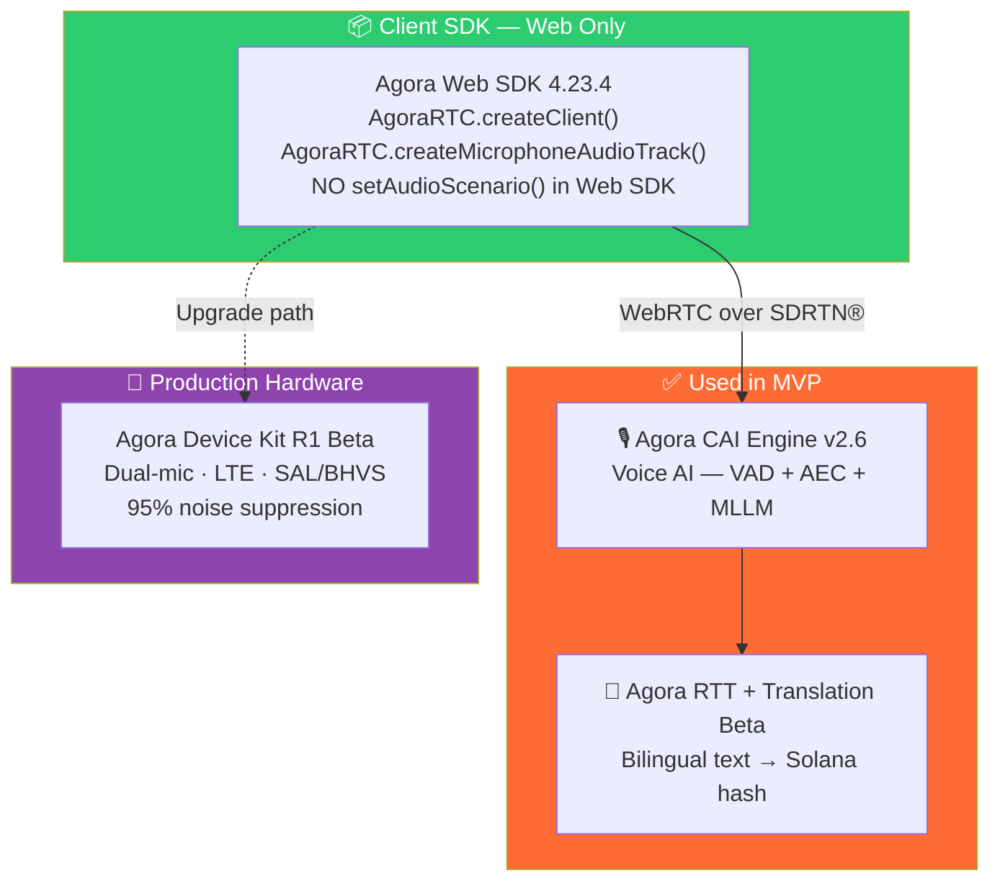

**Why not a native app?**
Mobile web has zero install friction — a worker can open a URL on any phone. For a hackathon demo, a QR code to a web URL is faster and more universally accessible than an APK install. For production, the Device Kit removes the phone entirely.

---

## 3. System Architecture

### 3.1 Full Component Diagram (Mobile Web Context)

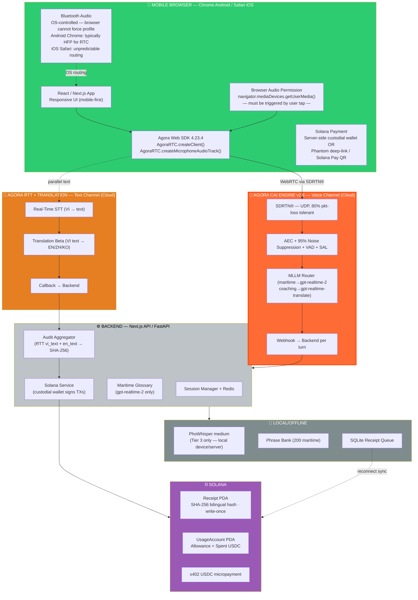

### 3.2 Dual-Channel Purpose

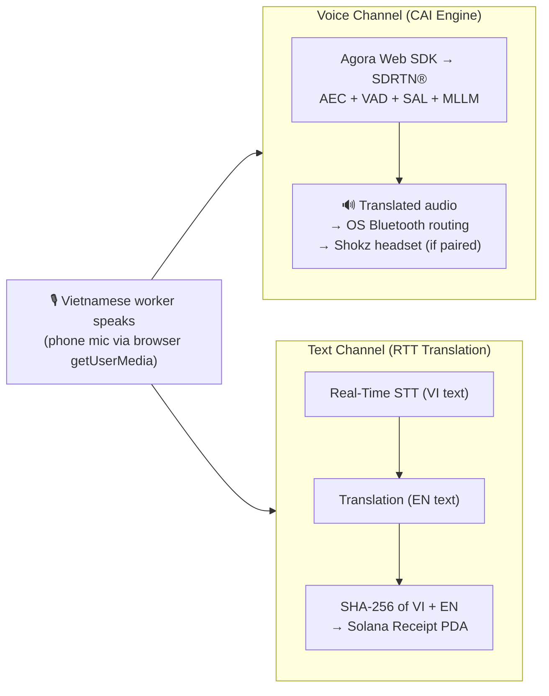

---

## 4. AI Model Selection

### 4.1 Two Models, Two Domains

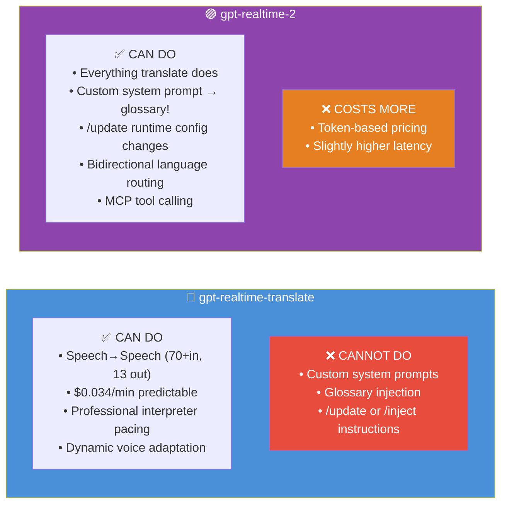

### 4.2 Domain Routing

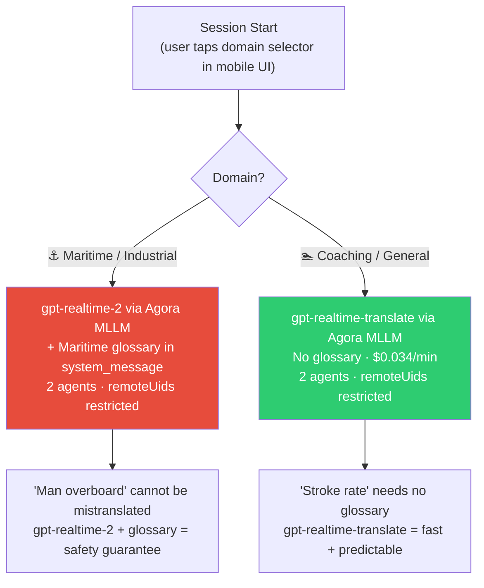

### 4.3 Two-Agent Bidirectional (remoteUids — one UID per agent)

```mermaid
sequenceDiagram
    participant Worker as 👷 VI Worker
UID 1001 · phone mic
    participant AgentVI as Agent A UID 9001
remoteUids:[2001]
output=VI (EN→VI)
    participant AgentEN as Agent B UID 9002
remoteUids:[1001]
output=EN (VI→EN)
    participant Super as 👔 EN Supervisor
UID 2001 · phone mic

    Note over Worker,Super: Same Agora channel · each agent subscribes to exactly ONE user (confirmed constraint)

    Worker->>AgentEN: 🎙️ Vietnamese
    AgentEN-->>Super: 🔊 English (via phone speaker)

    Super->>AgentVI: 🎙️ English
    AgentVI-->>Worker: 🔊 Vietnamese (via Shokz if OS-routed)

    Note over Worker,Super: ⚠️ remoteUids supports only 1 UID per agent currently
Validates 1-worker:1-supervisor design. Group mode awaits multi-UID support.
```

### 4.4 Runtime Updates

| Method | Behaviour | Use For |
|---|---|---|
| /update | Modifies agent config. Takes effect on next LLM invocation. No verbal side-effect. | Changing system_message (glossary update), VAD threshold, language pair |
| /inject | Inserts text as user input into conversation pipeline. Agent may verbally acknowledge. | One-off context correction (only with gpt-realtime-2) |

**Rule:** Prefer /update over /inject for all configuration changes in WaveLens.

### 4.5 Confirmed Output Languages (13)

English · Chinese · Korean · **Vietnamese** · Spanish · Portuguese · French · Japanese · Russian · Hindi · Indonesian · Italian · German

All three WaveLens targets (EN, ZH, KO) confirmed. Vietnamese as output confirms bidirectional capability.

---

## 5. VAD — Vietnamese in Noisy Environments

### 5.1 Speaker Isolation Hierarchy

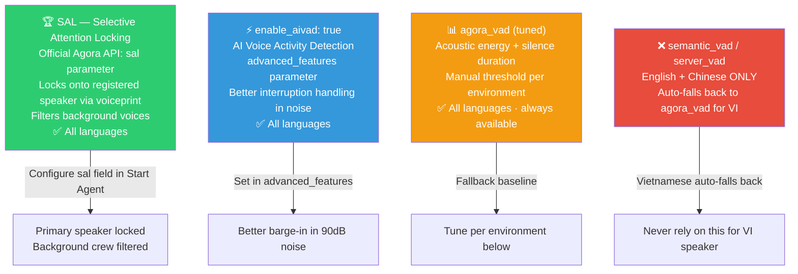

### 5.2 VAD Tuning Table

| Environment | Threshold | Silence ms | Notes |
|---|---|---|---|
| Container port (cranes) | 0.75 | 800 | SAL recommended — multiple workers nearby |
| Ship engine room | 0.80 | 900 | Loudest; machine vibration triggers |
| Ship bridge/deck | 0.70 | 720 | Wind spike noise |
| Poolside coaching | 0.60 | 640 | Near-default |
| EN/KO/ZH supervisor | Use semantic_vad | — | Smart VAD works for non-VI speakers |

---

## 6. Session Flow

### 6.1 Mobile Web Session Setup

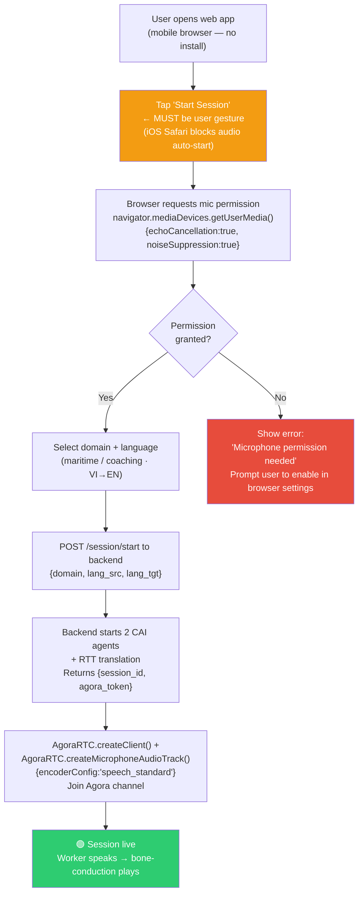


### 6.2 Full Conversational Turn

```mermaid
sequenceDiagram
    participant Worker as 👷 VI Worker
(mobile browser)
    participant Agora_CAI as 🔴 Agora CAI Engine
    participant Agora_RTT as 📝 Agora RTT
    participant Backend as ⚙️ Backend
    participant Solana as ⛓️ Solana

    rect rgb(255, 240, 230)
    Note over Worker,Backend: SESSION START (on user tap — mandatory for iOS Safari)
    Worker->>Backend: POST /session/start {domain:"maritime"}
    Backend->>Agora_CAI: Start Agent A (remoteUids:[super_uid], output=VI)
    Backend->>Agora_CAI: Start Agent B (remoteUids:[worker_uid], output=EN, maritime glossary)
    Backend->>Agora_RTT: Start STT+Translation (VI→EN text)
    Backend-->>Worker: {session_id, agora_token, channel}
    Worker->>Agora_CAI: createMicrophoneAudioTrack + joinChannel
    end

    rect rgb(230, 245, 255)
    Note over Worker,Agora_RTT: PARALLEL TURN PROCESSING
    Worker->>Agora_CAI: 🎙️ Vietnamese (getUserMedia stream)
    Agora_CAI->>Agora_CAI: AEC + noise suppress
SAL + enable_aivad + VAD 0.75
    Agora_CAI-->>Worker: 🔊 Translated audio → OS routes to Shokz (if connected)
    Agora_CAI->>Backend: Webhook {turn_id, metadata}
    Worker->>Agora_RTT: Same audio (parallel subscription)
    Agora_RTT->>Backend: {vi_text, en_text, timestamp}
    Backend->>Backend: Aggregate bilingual transcript

    alt Domain term mistranslated
        Backend->>Agora_CAI: POST /update {system_message: updated glossary}
        Note over Agora_CAI: Takes effect next LLM invocation (no verbal side-effect)
    end
    end

    rect rgb(230, 255, 240)
    Note over Backend,Solana: SESSION END (user taps Stop)
    Worker->>Backend: POST /session/end {session_id}
    Backend->>Backend: SHA-256(vi_texts + en_texts + metadata)
    Backend->>Solana: create_receipt PDA [ASYNC · server-side custodial wallet signs]
    Backend->>Solana: USDC transfer x402 [custodial]
    Backend-->>Worker: {receipt_tx_hash, fee_usdc}
    end
```

### 6.3 Offline Tiers (Mobile Web Context)

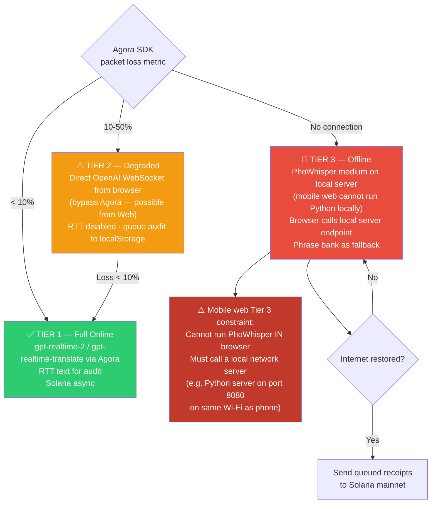

---

## 7. Solana Integration

### 7.1 Alpenglow — June 2026 Status

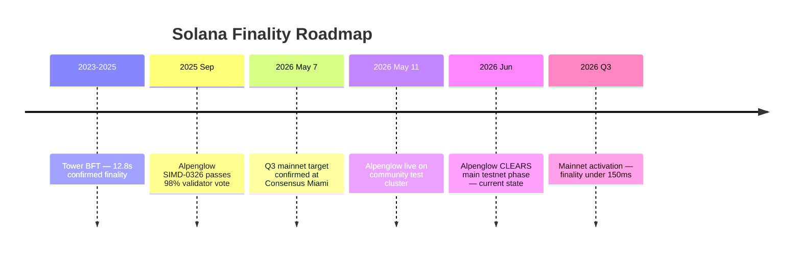

Receipts are async by design. When Alpenglow reaches mainnet, "confirmed" appears in ~150ms. No code changes needed.

### 7.2 Mobile Web Solana Wallet Strategy

**The core problem on mobile web:** Browser extensions do not exist on mobile Chrome or Safari. There is no window.phantom unless the user opens the app inside the Phantom mobile browser.

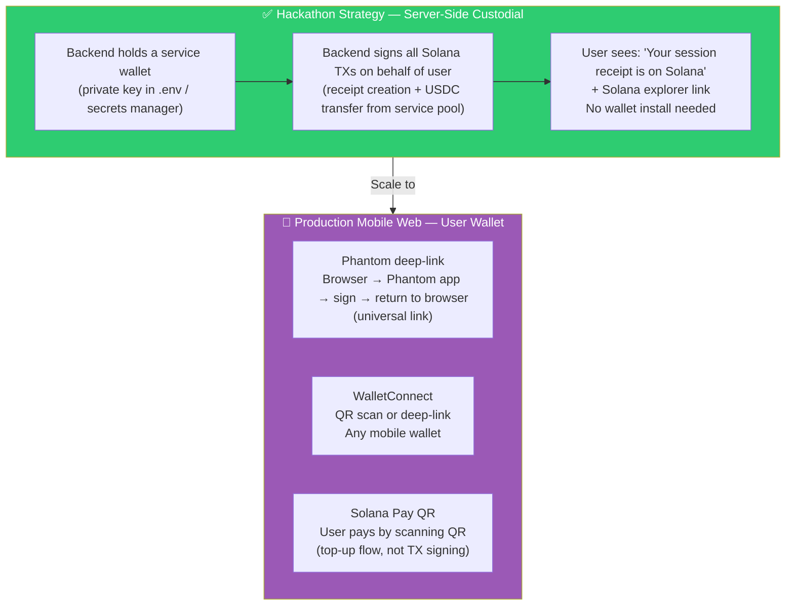

**Hackathon recommendation:** Use server-side custodial wallet for all Solana interactions. The team keeps one service wallet funded with Devnet SOL + USDC. The backend signs every transaction. The user never needs a wallet — they just see the explorer link.

### 7.3 Two-Account Architecture

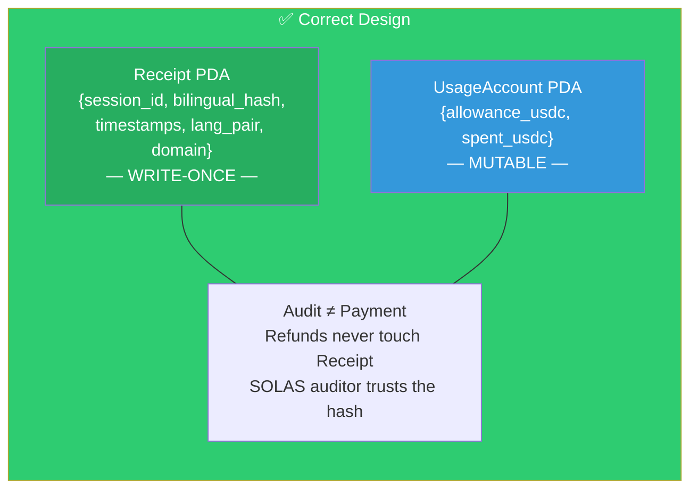

### 7.4 What Goes in the Solana Hash

SHA-256 input (canonical JSON — sorted keys, UTF-8, no whitespace):
- vi_texts[] — Vietnamese originals from Agora RTT STT per turn
- en_texts[] — English translations from Agora RTT Translation per turn
- session_id, timestamp_start, timestamp_end, lang_pair, domain, turn_count

This gives auditors both languages on-chain. They can verify translation fidelity, not just that speech occurred.

### 7.5 Payment Flow

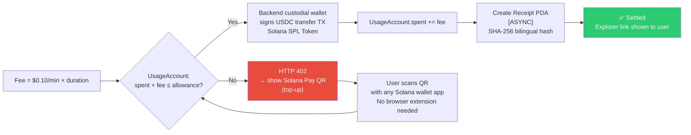

---

## 8. Hardware Integration — Mobile Web Reality

### 8.1 The Fundamental Difference: Web vs Native

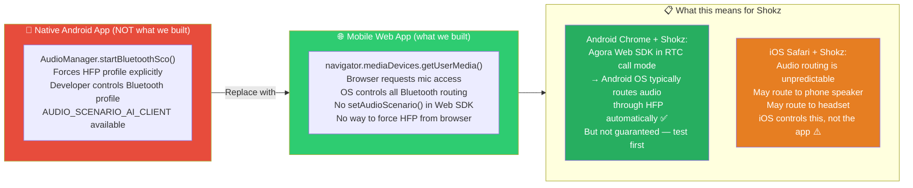

### 8.2 Agora Web SDK Audio Configuration (Correct for Mobile Web)

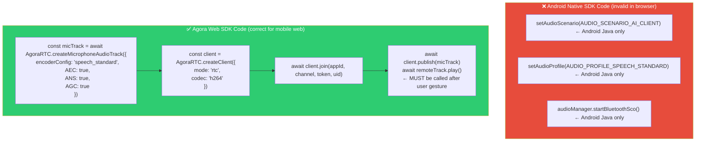

**Web SDK encoderConfig options for voice:** speech_standard (16kHz, 24kbps) is the closest equivalent to AUDIO_PROFILE_SPEECH_STANDARD. Do NOT use high_quality — wastes bandwidth and degrades AEC in browser.

### 8.3 Bluetooth Headset on Mobile Web — How It Actually Works

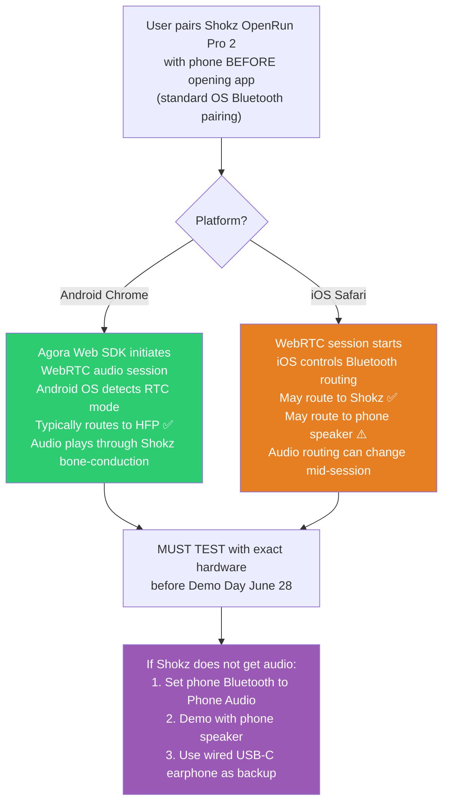


---

## 9. Implementation Timeline

### 9.1 9-Day Build Sprint — Demo Day June 28

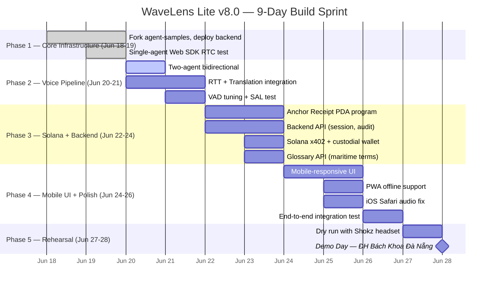

### 9.2 Today — June 20 Activation

| Priority | Task | Est. | Owner |
|---|---|---|---|
| 🟢 P0 | Two-agent bidirectional (remoteUids) | 4h | Voice |
| 🟢 P0 | RTT + Translation Beta integration | 3h | Voice |
| 🟡 P1 | Session manager backend (Next.js API) | 3h | Backend |
| 🟡 P1 | VAD tuning (enable_aivad, sal, thresholds) | 2h | Voice |
| 🔵 P2 | Maritime glossary API + agent /update | 3h | Backend |
| ⚪ P3 | Mobile-responsive UI | 2h | Frontend |

---

## 10. iOS Safari Checklist

### 10.1 Why iOS Safari is a Special Case

iOS Safari has the strictest WebRTC implementation of any mobile browser. Every hackathon team targeting mobile web MUST test on an actual iPhone.

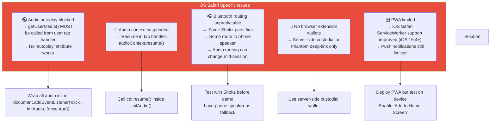

### 10.2 iOS Safari Minimum Viable Audio

```javascript
// WaveLens Lite — iOS Safari safe audio init
// MUST be called from user tap handler
async function initAgora(userId) {
    // 1. Create client
    const client = AgoraRTC.createClient({
        mode: "rtc",
        codec: "h264"
    });

    // 2. Resume AudioContext if any
    if (typeof AudioContext !== "undefined") {
        const ctx = new AudioContext();
        if (ctx.state === "suspended") await ctx.resume();
    }

    // 3. Create mic track (iOS needs constraints)
    const micTrack = await AgoraRTC.createMicrophoneAudioTrack({
        encoderConfig: "speech_standard",
        AEC: true,
        ANS: true
    });

    // 4. Join + Publish
    await client.join(appId, channel, token, userId);
    await client.publish([micTrack]);

    return { client, micTrack };
}
```

---

## 11. Demo Day Rehearsal

### 11.1 Script — 3-Minute Demo (English)

| Time | Action | Screen | Audio |
|---|---|---|---|
| 0:00 | "WaveLens Lite — real-time voice translation" | Landing page, QR code | — |
| 0:15 | "Just scan QR, no app install" | Phone scans QR, page loads | — |
| 0:30 | Tap Start, select Maritime VI→EN | UI interaction | — |
| 0:45 | "Xin chào, chúng ta có container số 3 cần kiểm tra" | Live session UI | VI → EN translation plays |
| 1:15 | "Let's check container #3" (by teammate in EN) | Live session UI | EN → VI |
| 1:45 | "Now let's see the blockchain receipt" | Solana explorer page | — |
| 2:15 | "Built with Agora CAI + Solana in 9 days" | Architecture slide | — |
| 2:45 | "Thank you — ready for questions" | Q&A | — |
| 3:00 | End | — | — |

### 11.2 Demo Checklist

- [ ] **Shokz connection verified** — paired with demo phone, audio routes correctly
- [ ] **iOS Safari** — test on actual iPhone (not simulator)
- [ ] **Fallback audio** — wired USB-C earphone available (phone speaker is backup)
- [ ] **QR code** — printed large, scannable from 1m
- [ ] **Hotspot** — dedicated phone wifi hotspot (venue wifi may be unreliable)
- [ ] **Solana Devnet** — custodial wallet funded + working
- [ ] **Database** — receipts visible on Solana explorer test endpoint
- [ ] **Rehearsal** — full 3-min run through with roles assigned
- [ ] **Backup phone** — second phone pre-loaded with app

---

## 12. Ecosystem Checklist

### 12.1 Pre-Pitch Checklist (June 28 Morning)

- [ ] Agora Web SDK 4.23.4 verified working
- [ ] Two-agents running, remoteUids correct constraint
- [ ] RTT text arriving in backend webhook
- [ ] VAD tuned for demo environment (indoor quieter than port)
- [ ] SAL works (register speaker)
- [ ] /update endpoint working for glossary changes
- [ ] Solana Receipt PDA written and visible on explorer
- [ ] x402 USDC transfer succeeds (custodial wallet)
- [ ] Maritime glossary loaded into gpt-realtime-2
- [ ] Coach mode working with gpt-realtime-translate
- [ ] PWA service worker registered (offline phrase bank)
- [ ] iOS Safari: audio works on user tap
- [ ] Session start/end flow completes without error
- [ ] Receipt aggregation logic correct (bilingual SHA-256)
- [ ] Mobile-responsive UI works on 6.1" phone screen

---

## Appendix A: Web SDK vs Native SDK Quick Reference

| Concept | Android Native SDK | Web SDK | Notes |
|---|---|---|---|
| Audio profile | setAudioProfile(AUDIO_PROFILE_SPEECH_STANDARD) | encoderConfig: 'speech_standard' in createMicrophoneAudioTrack() | Different API shape, same result |
| Audio scenario | setAudioScenario(AUDIO_SCENARIO_AI_CLIENT) | ❌ No setAudioScenario() in Web SDK | Web SDK handles this internally — no configuration needed |
| Bluetooth SCO | startBluetoothSco() | ❌ Not possible from browser | OS handles routing. Must test on device |
| AI VAD | setParameters("{"che.audio.enable_aivad": true}") | advanced_features: { enable_aivad: true } in Start Agent request | Same parameter name, different API path |
| Channel join | joinChannel(token, channel, uid) | client.join(appId, channel, token, uid) | Promise-based in Web SDK |
| Remote audio | AudioTrack.play() | remoteAudioTrack.play() | Works the same |
| Mic capture | MediaRecorder or AudioRecord | getUserMedia() via createMicrophoneAudioTrack() | Browser permission dialog appears |
| Channel encryption | setEncryptionConfig() | client.setEncryptionConfig() | Same API |
| Logging | setLogFile() | AgoraRTC.setLogLevel() | Web SDK logs to console |
| Dual-track mode | enableDualStreamMono() | ❌ Not available in Web SDK | Web SDK handles this automatically |

---

## Appendix B: Agora SDK Documentation Map

| Topic | Link |
|---|---|
| Web SDK landing | https://docs.agora.io/en/video-calling/reference/web-sdk/api-overview |
| createMicrophoneAudioTrack | https://docs.agora.io/en/video-calling/reference/web-sdk/api-reference/IAgoraRTC/createMicrophoneAudioTrack |
| Agora CAI REST API | https://docs.agora.io/en/conversational-ai/reference/rest-api/start-agent |
| Start Agent with SAL | https://docs.agora.io/en/conversational-ai/reference/rest-api/start-agent#sal-params |
| /update endpoint | https://docs.agora.io/en/conversational-ai/reference/rest-api/update-agent |
| MLLM config | https://docs.agora.io/en/conversational-ai/reference/rest-api/configure-mllm |
| RTT+Translation Beta | https://docs.agora.io/en/conversational-ai/reference/rest-api/stream-rtt-translation |
| CAI Web SDK guide | https://docs.agora.io/en/conversational-ai/get-started/web-sdk |
| CAI language support | https://docs.agora.io/en/conversational-ai/reference/language-support |
| agent-samples (GitHub) | https://github.com/AgoraIO-Conversational-AI/agent-samples |
| Devnet faucet | https://faucet.solana.com |
| Explorer (Devnet) | https://explorer.solana.com/?cluster=devnet |
| Solana Pay docs | https://docs.solanapay.com |
| Alpenglow status | https://solana.com/alpenglow |

---

## Appendix C: Development Environment Setup

### C.1 Prerequisites

```bash
# Node.js 18+ (for Next.js)
node --version   # v18.17+ or v20.x

# Agora Web SDK (added to Next.js project)
npm install agora-rtc-sdk-ng  # v4.23.4

# Agora CAI requires no client SDK — it's REST API + Web SDK transport

# Solana CLI (for Anchor program development)
sh -c "$(curl -sSfL https://release.anza.xyz/stable/install)"
solana --version

# Anchor
cargo install --git https://github.com/coral-xyz/anchor anchor-cli

# Vietnamese STT (offline Tier 3)
pip install torch transformers soundfile
# Model: vinai/PhoWhisper-medium
```

### C.2 Env Configuration

```env
# .env.local — NEVER COMMIT
NEXT_PUBLIC_AGORA_APP_ID=your_app_id
AGORA_APP_CERTIFICATE=your_app_certificate
AGORA_CUSTOMER_ID=your_customer_id
AGORA_CUSTOMER_SECRET=your_customer_secret
SOLANA_PRIVATE_KEY=your_custodial_wallet_private_key
SOLANA_RPC_URL=https://api.devnet.solana.com
```

---

## Appendix D: Deployment Checklist

### D.1 Before Demo Day

- [ ] Backend deployed to Vercel / Railway / Fly.io
- [ ] CORS configured for mobile web requests
- [ ] Agora token generation working server-side
- [ ] Solana custodial wallet funded (Devnet SOL + USDC)
- [ ] RTT callback endpoint receiving and storing data
- [ ] Mobile-responsive layout tested on Chrome Android + Safari iOS
- [ ] Audio starts from user tap on real iOS device
- [ ] Shokz headset audio routing tested on Android
- [ ] Session end flow stores receipt to Solana successfully
- [ ] Error state recovery (network drop, mic permission denied)
- [ ] PWA manifest + icons set up
- [ ] QR code generator ready for demo
- [ ] Domain switching (Maritime ↔ Coaching) functional
- [ ] VAD thresholds adjusted for venue acoustics

### D.2 Deployment Architecture

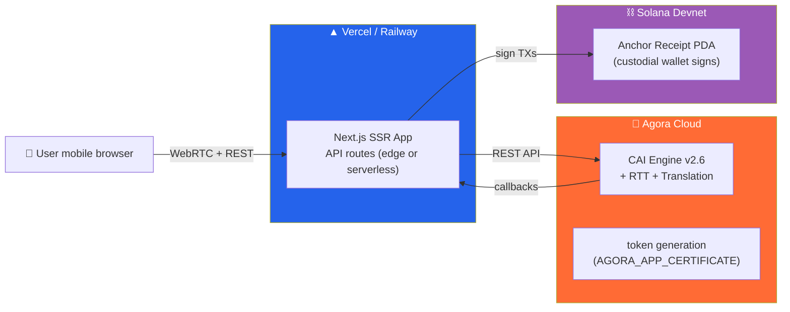

---

> **WaveLens Lite v8.0 — Da Nang, June 2026**
> Built for Convo AI Hackathon by Agora × Solana at Đại học Bách Khoa Đà Nẵng
> 9 days of a smarter Vietnam, one bilingual conversation at a time 🇻🇳
