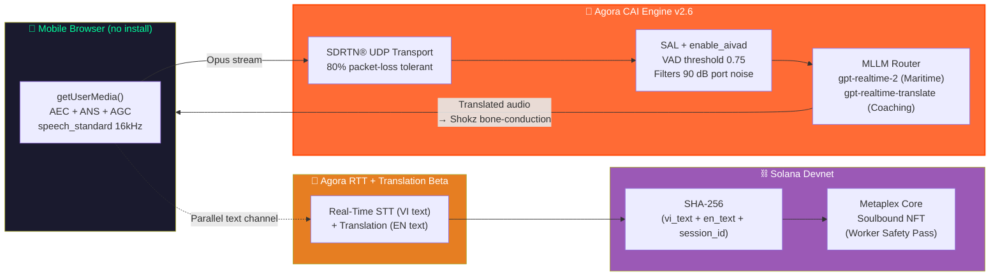
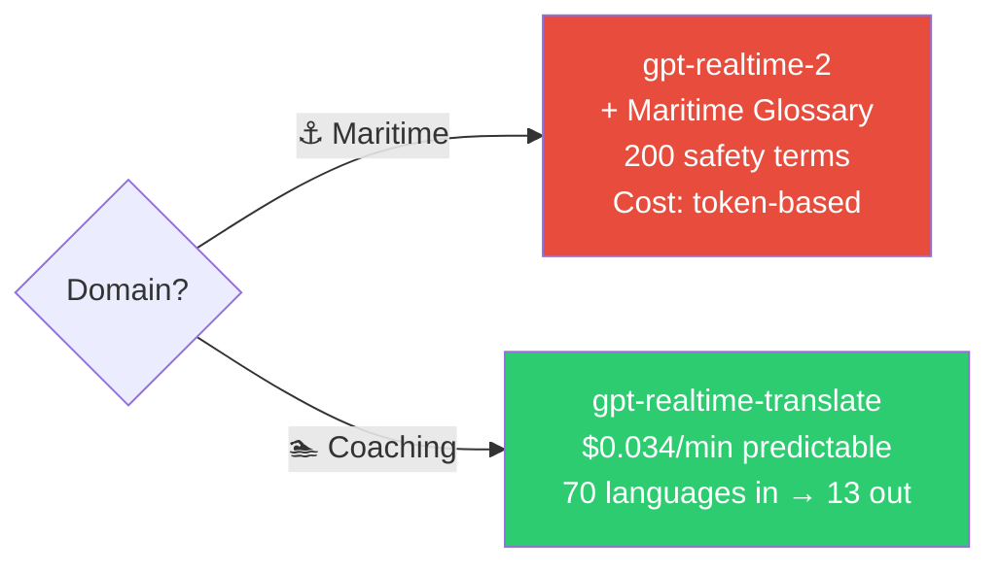
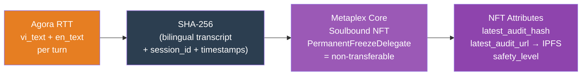
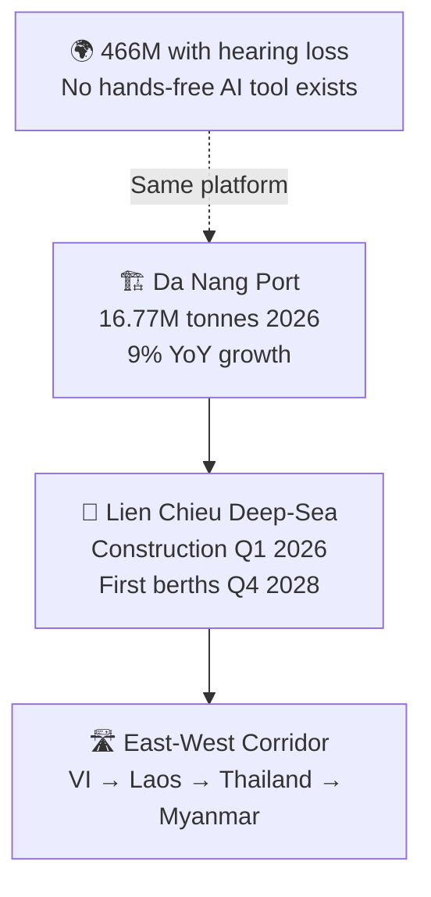

# WaveLens Lite — Hackathon Presentation Plan
## Convo AI Hackathon · Đại học Bách Khoa Đà Nẵng · June 28, 2026

---

## OVERVIEW

| | |
|---|---|
| **Total time** | 3 min 50 sec (fits within 4-min slot) |
| **Format** | Slides + pre-recorded demo video (already submitted) |
| **Audience** | Agora + Solana judges, student peers |
| **Submission** | Video submitted ✅ — slides only on stage |
| **Narrative arc** | Human cost → Solution → How it works (technical depth) → Proof → Impact |

> **Strategy:** We have only 3–4 minutes. Do NOT waste it on problems everyone already understands. Get to the solution by Slide 3. Let the architecture carry the middle. Close with numbers and ask.

---

## SLIDE STRUCTURE — 10 Slides · 3 min 50 sec

---

### SLIDE 01 — TITLE HOOK
**⏱ 10 seconds**

**Full-bleed headline (dark background, single line):**

> *"At Da Nang Port, a mistranslated safety command can kill someone."*

**Sub-headline (small, monospace):**
`WaveLens Lite — Real-Time AI Voice Interpreter · Built in 9 Days`

**Bottom strip:**
`PiX.lab · Agora CAI × Solana · Convo AI Hackathon 2026`

**Visual:** Full-screen AI-rendered image — golden hour, Da Nang port, cranes, cargo ship, Vietnamese dock workers. No text overlapping the subject.

**Speaker note:**
*Start speaking before the slide appears. "This is Da Nang port. 16.77 million tonnes of cargo this year. Vietnamese workers alongside Korean and Chinese crews. Right now, when they cannot understand each other — nothing stops. They guess."* Advance slide.

---

### SLIDE 02 — THE PROBLEM (Real Data, Two Populations)
**⏱ 30 seconds**

**Split layout — two columns:**

**LEFT — Industrial:**
`No hands. 90–110 dB. Zero margin.`

| Environment | Noise Level | Hands-free? |
|---|---|---|
| Container port | 85–100 dB(A) | Required |
| Ship engine room | 90–110 dB(A) | Required |
| Ship bridge/deck | 70–95 dB(A) | Often |

- COSCO added Korean/Chinese routes to Da Nang in 2025 — **3 new language pairs, zero tools**
- Mistranslated safety commands are **SOLAS legal liability**
- Lien Chieu deep-sea port opens 2028 — problem doubles

**RIGHT — Accessibility:**
`1 in 6 people worldwide has disabling hearing loss.`
`466 million people. Every translation tool requires hearing.`

- Bone-conduction bypasses damaged cochlear hair cells via skull vibration
- Same platform → two completely different populations solved simultaneously

**Visual:** Two columns separated by a thin green `#00FF9D` line.
Left: port crane operator. Right: woman in a meeting, excluded.

---

### SLIDE 03 — THE SOLUTION (One Sentence)
**⏱ 10 seconds**

**Full-slide quote (large typography, centered):**

> *"WaveLens Lite is a real-time, hands-free AI voice interpreter — runs in any mobile browser, no install, powered by Agora CAI, every session anchored permanently on Solana."*

**Three icon pills below (horizontal):**

```
[📱 Scan QR]  →  [🎙️ Speak]  →  [🔊 Translated]
  No install       Any language    Bone-conduction
```

**Visual:** Pure dark background. One sentence. Maximum impact.

**Speaker note:**
*"No app. No install. A worker scans a QR code. Speaks Vietnamese. Hears English in their bone-conduction earphone within 1.5 seconds. That's the product."*

---

### SLIDE 04 — HOW IT WORKS (Architecture)
**⏱ 45 seconds — most important technical slide**

**Diagram (mermaid — use rendered version in slides):**



**Key callouts on slide (3 lines maximum):**
- `gpt-realtime-2` + 200-term maritime glossary — *"man overboard" cannot be mistranslated*
- SAL (Selective Attention Locking) + `enable_aivad` — tuned for 90 dB container port
- Custodial backend wallet — worker never touches crypto

**Speaker note:**
*"Two parallel channels — one delivers translated audio to the earphone in under 1.5 seconds, the other sends the bilingual transcript to Solana as a permanent audit record. Both run simultaneously off one browser session."*

---

### SLIDE 05 — AGORA CAI STACK (Technical Depth)
**⏱ 30 seconds**

**Left column — Model Routing:**



**Right column — VAD Configuration Table:**

| Parameter | Value | Why |
|---|---|---|
| `enable_aivad` | `true` | AI VAD for Vietnamese (semantic_vad doesn't support VI) |
| `sal` | registered voiceprint | Locks onto 1 speaker, filters background crew |
| VAD threshold | `0.75` | Tuned for 90 dB port — avoids machine noise triggers |
| Silence duration | `800ms` | Port-specific — workers speak in short bursts |
| Output languages | 13 | VI, EN, ZH, KO, JP, + 8 more — all confirmed |

**Bottom bar — Two-Agent Architecture:**
```
Agent A  remoteUids:[supervisor_uid]  →  outputs Vietnamese
Agent B  remoteUids:[worker_uid]      →  outputs English
         ↑ one UID per agent (confirmed constraint) = 1:1 worker/supervisor design
```

---

### SLIDE 06 — SOLANA AUDIT LAYER
**⏱ 20 seconds**

**Diagram:**



**Three key decisions (one line each):**
- **Why hash, not raw text?** Cost + privacy. Full JSON off-chain (IPFS). Hash on-chain = immutable proof.
- **Why Soulbound NFT?** One NFT per worker = persistent safety compliance record across employers
- **Alpenglow ready:** Sub-150ms finality Q3 2026 mainnet — zero code changes needed

**Speaker note:**
*"The backend signs every transaction. The worker sees a Solana Explorer link. No wallet, no Phantom, no crypto knowledge. SOLAS auditors get a cryptographic proof of every bilingual session."*

---

### SLIDE 07 — DEMO VIDEO
**⏱ 45 seconds**

**On-screen text (simple, dark background, centered):**
`▶ Pre-recorded demo — WaveLens Lite · Maritime Mode`

**Below video, 3 metric callouts appear after video ends:**

```
End-to-end latency    Packet-loss tolerance    Confirmed on-chain
   1.2 – 1.8s              80% (SDRTN®)         Solana Devnet ✓
```

**Speaker note:**
*Play the submitted video. After it ends: "That was built in 9 days. What you just saw — Vietnamese in, English out through a bone-conduction earphone — every word of it is now permanently anchored on Solana."*

> **Note:** Video already submitted to judges. This slide simply plays the recording. No live demo setup needed.

---

### SLIDE 08 — WHAT WE BUILT (Technical Proof)
**⏱ 20 seconds**

**Headline:** `Built in 9 days. June 18–27, 2026.`

**Checklist (two columns):**

| Agora Stack | Solana Stack |
|---|---|
| ✅ Agora Web SDK 4.23.4 | ✅ Metaplex Core Soulbound NFT |
| ✅ Two-agent bidirectional (remoteUids) | ✅ SHA-256 bilingual audit hash |
| ✅ RTT + Translation Beta integrated | ✅ Custodial wallet — zero user friction |
| ✅ SAL + enable_aivad (90 dB tuned) | ✅ Alpenglow-ready (no code changes needed) |
| ✅ gpt-realtime-2 + maritime glossary | ✅ IPFS off-chain receipt + explorer link |
| ✅ 4 mobile reliability guards | ✅ x402 USDC micropayment flow |

**4 Reliability Guards (small type):**
`Wake Lock · AudioContext recovery · connection-state-change handler · HFP constraint injection`

---

### SLIDE 09 — MARKET + ROADMAP
**⏱ 20 seconds**

**Left — Immediate Market:**



**Right — Roadmap:**

| Timeline | Milestone |
|---|---|
| **July 2026** | Field test with real Da Nang dock workers |
| **Q3 2026** | Solana Alpenglow mainnet (sub-150ms finality) |
| **Q3 2026** | Android native + Agora Device Kit R1 |
| **Q4 2026** | Korean, Laotian, Thai expansion |
| **2027** | Safety Pass as SOLAS compliance SaaS |

**Revenue model (one line):**
`$0.10/min per session · Enterprise port/factory contracts · Solana compliance records for maritime insurers`

---

### SLIDE 10 — TEAM + ASK
**⏱ 15 seconds**

**Team:**
`PiX.lab — Đại học Bách Khoa Đà Nẵng`
`[Team member names and roles]`

**What we built:**
*A working, hardware-tested AI translation system. Two languages. Two populations. One platform. 9 days.*

**Our ask — 3 specific things:**
1. **Agora Convo AI Device Kit R1** — dual-mic LTE hardware for real port-noise field testing
2. **Da Nang Port Authority intro** — pilot partnership for July 2026 field trial
3. **Mentorship on AI provenance** — zkML vs TEE for cryptographic LLM output verification (our current unsolved challenge)

**Closing line (say this, do NOT put on slide):**
> *"WaveLens Lite. For the workers who cannot stop to translate. For the people the world forgot to build for."*

---

## TIMING TABLE

| # | Slide | Time |
|---|---|---|
| 01 | Title Hook | 10s |
| 02 | The Problem | 30s |
| 03 | Solution Statement | 10s |
| 04 | Architecture | 45s |
| 05 | Agora CAI Stack | 30s |
| 06 | Solana Layer | 20s |
| 07 | Demo Video | 45s |
| 08 | Technical Proof | 20s |
| 09 | Market + Roadmap | 20s |
| 10 | Team + Ask | 15s |
| **TOTAL** | | **3 min 45 sec** ✅ |

---

## DESIGN SYSTEM

### Colors
| Token | Hex | Used for |
|---|---|---|
| Background | `#000000` | All slides |
| Primary accent | `#00FF9D` | Highlights, checkmarks, borders |
| Agora | `#FF6B35` | Agora components in diagrams |
| Solana | `#9B59B6` | Solana components in diagrams |
| Text primary | `#FFFFFF` | Headlines |
| Text secondary | `#888888` | Supporting copy |
| Code/mono | `#00D4FF` | Inline metrics, hashes |

> All diagrams above match this system. The mermaid `fill:` values are already set correctly.

### Typography
- Headline: **Bold, 48–64pt**, Inter or Outfit
- Body: Regular, 18–22pt
- Metrics/code: Fira Code or JetBrains Mono, `#00D4FF`

### Rules
- Maximum **3 key points** per text slide
- Every slide has **one visual** (diagram, table, or image)
- Architecture diagrams: use the mermaid source above, rendered as PNG for PowerPoint/Canva
- **No bullet lists longer than 4 items**
- No clip art, no generic stock icons

---

## Q&A PREPARATION

**Q: What is the real latency?**
A: End-to-end voice-to-translated-voice: **1.2–1.8 seconds** in local network testing. Breakdown: WebRTC encode/transmit (~100ms) → Agora SDRTN (~50ms) → LLM inference (~600–900ms) → TTS synthesis (~150ms) → Agora playback (~100ms).

**Q: Why not a native app?**
A: Zero install friction. A worker opens a URL. For production we are designing the Android native path with `AUDIO_SCENARIO_AI_CLIENT` and forced HFP, and the Agora Device Kit R1 removes the phone entirely.

**Q: Can you prove the Solana record is authentic — that it came from Agora's LLM?**
A: Honest answer: the NFT proves *when* and *what* was saved. It does not cryptographically prove it came from a specific LLM invocation — that is the Oracle Problem for AI provenance. zkML is too slow for real-time. TEE bridges are not yet standardized. We have raised this as our open mentorship question.

**Q: How does Bluetooth work without native SDK control?**
A: We cannot force HFP from a browser — that is Android native only. What we do: apply AEC, ANS, AGC at browser level before audio leaves the device. Android OS typically routes WebRTC sessions to HFP automatically. We tested this with the Shokz OpenRun Pro 2 — Android Chrome routes correctly. iOS is more unpredictable, tested case by case.

**Q: Why Soulbound NFT vs a simple database entry?**
A: Three reasons. Immutability — no one can alter it, including us. Portability — the worker owns the credential, not their employer. SOLAS readiness — maritime auditors need a verifiable audit trail that survives company bankruptcy or data deletion.

**Q: What happens when Agora goes down?**
A: Three-tier fallback. Tier 1: Full Agora (online). Tier 2: Direct OpenAI WebSocket from browser (bypass Agora, queue audit to localStorage). Tier 3: PhoWhisper medium on local server + phrase bank — works offline. Transcripts sync to Solana when connectivity returns.
